# Auto-Affi Production Usage

คู่มือนี้รวบรวมวิธีสั่งงาน production คลิปสินค้า Auto-Affi ให้เดินตาม workflow ล่าสุด และไม่หลุดจาก success scenario ของ Hanky V12

> 📚 **Knowledge base ฉบับเต็มอยู่ที่ [`wiki/HOME.md`](wiki/HOME.md)** — architecture, compliance gates, model locks, data registry, principles ทั้ง 17 ฉบับ, lessons learned ของทุก run

## หลักการสั้นที่สุด

ถ้าต้องการทำคลิปสินค้าใหม่ ให้เริ่มด้วย skill นี้เสมอ:

```text
ใช้ $auto-affi-new-product-clip
```

skill นี้เป็น front door สำหรับงาน production ใหม่ และจะบังคับให้เดินผ่าน workflow หลัก:

```text
$auto-affi-new-product-clip -> $auto-affi-one-shot-workflow
```

อย่าสั่งแค่ `Go` หรือ `Next` ถ้ายังไม่ได้เห็นและ approve storyboard/contact sheet เพราะ workflow ต้องหยุดก่อน spend เครดิตทุกครั้ง

## Model Locks

- Text/story/script/reasoning production lock: ใช้ model text ที่กำหนดใน workflow ล่าสุดเท่านั้น
- Image generation: ใช้ `Nano Banana Pro` ผ่าน **OpenRouter** เท่านั้น
- Visual video generation: ใช้ `seedance_2_0` ผ่าน **OpenRouter** เท่านั้น
- Voiceover (VO) generation: ใช้ `elevenlabs` ผ่าน **Kie.ai** เท่านั้น
- ห้าม fallback ไป model อื่นเอง ถ้า model หลักใช้ไม่ได้ ให้หยุดและรายงาน

## Environment และ API Keys

- Key ทุกตัวที่จำเป็นสำหรับ provider ต้องอยู่ใน `.env`
- ห้าม paste secret ลง README, prompt, log, หรือ artifact ที่แชร์ต่อ
- ถ้า key หายหรือโหลดไม่ได้ ให้หยุด workflow และรายงานว่า key ตัวไหนขาด โดยไม่ยิง provider

## Prompt ที่ควรใช้

### เริ่มคลิปสินค้าใหม่จากทีม marketing

```text
ใช้ $auto-affi-new-product-clip
เริ่ม production คลิปสินค้าใหม่ 60 วินาที
ให้ทีม marketing เลือกสินค้าใหม่ 1 ตัว
หลังเลือกสินค้าแล้ว ให้ search Google/web/image เพื่อเก็บข้อมูลและรูปอ้างอิงให้มากพอ
สรุป research เพื่อใช้สร้าง prompt image และ video
ใช้ Nano Banana Pro (ผ่าน OpenRouter) สำหรับภาพ/reference/keyframe/storyboard เท่านั้น
ใช้ Seedance 2.0 (ผ่าน OpenRouter) สำหรับ video เท่านั้น
สร้าง Voiceover (VO) ด้วย elevenlabs (ผ่าน Kie.ai) เท่านั้น
ทำ storyboard/contact sheet ให้ดูก่อน ห้ามยิง provider จนกว่าฉัน approve
```

### เริ่มจาก Shopee หรือ affiliate URL

```text
ใช้ $auto-affi-new-product-clip
ทำคลิปสินค้าใหม่จาก URL นี้: <url>
ต้องใช้ /browser ดาวน์โหลดรูปจาก Shopee/Google มาเก็บไว้ให้มากที่สุด Property ต้องเป๊ะ
เช็คโฟลเดอร์ source_images ถ้าว่างเปล่า ห้ามเสนอ Concept (ไอเดีย) เด็ดขาด ให้หยุดระบบและหาทางดาวน์โหลดรูปให้สำเร็จก่อน
สร้าง Sub-agent (spawn teams) นำเสนอ Concept มาให้เลือก 5 story
เมื่อฉัน Approve story แล้ว ให้เขียนบทแบบ Second-by-second (TTS) ตามความยาวคลิป
ตั้งทีม Product Council ตรวจสอบ Script อย่างละเอียดก่อนให้ฉัน Approve
ถ้า Approve แล้ว ให้สร้างไฟล์เสียง (VO 1 ไฟล์) และไฟล์ TTS ให้เสร็จสมบูรณ์
ห้ามเริ่มออกแบบฉาก (Location) หรือ Storyboard จนกว่าจะได้ไฟล์เสียงและไฟล์ TTS ครบถ้วน
ใช้ Nano Banana Pro (ผ่าน OpenRouter) สำหรับภาพ/reference/keyframe/storyboard เท่านั้น
ใช้ Seedance 2.0 (ผ่าน OpenRouter) สำหรับ video เท่านั้น
สร้าง Voiceover (VO) ด้วย elevenlabs (ผ่าน Kie.ai) เท่านั้น
โชว์ storyboard/contact sheet ให้ฉัน approve ก่อนจ่ายเครดิตวิดีโอ
```

### Approve หลังเห็น storyboard/contact sheet

```text
Approve storyboard/contact sheet นี้
เริ่ม Seedance 2.0 motion test 3 ช็อตสำคัญเท่านั้น
หลังเสร็จให้ทำ numbered contact sheet/dailies QC
ถ้ามี continuity, physics, product, prop, location หรือ caption/voice issue ให้ reject และ regenerate เฉพาะช็อตที่พัง
```

### Resume งานที่ค้างหรือถูก block

```text
ใช้ $auto-affi-new-product-clip
resume run <run-id>
ตรวจว่า deep_product_research, visual_reference_board, research_synthesis,
success_scenario_review และ pre_generation_user_review ผ่านครบหรือยัง
ถ้ายังไม่ครบ ห้ามยิง provider
```

## Workflow มี 2 ระดับ

README นี้ตั้งใจให้มีทั้งสองระดับ:

- Quick-start prompt: เอาไว้สั่งงานให้ถูกทางใน 1 ข้อความ
- Full production orchestration: เอาไว้ audit ว่างานเดินครบเหมือน workflow จริง ไม่ใช่แค่สรุป flat ๆ

ถ้าต้องทำงาน production จริง ให้ยึด full flow ด้านล่าง ไม่ใช่ดูเฉพาะ prompt สั้น

## Full Production Flow

```mermaid
flowchart TD
    A["Viral / News / Social Signals"] --> B{"Ethics and Product-Mapping Gate"}
    B -- "red or unsafe" --> H["Human Review Inbox"]
    B -- "green or approved amber" --> C["Marketing Collection"]
    C --> D["Marketing selects exactly 1 product"]
    D --> E["Deep Google / Product / Market Research + Browser Image Downloads"]
    E --> F["deep_product_research.json + visual_reference_board.json + research_synthesis.md"]
    F --> G{"Research Dense Enough?"}
    G -- "thin, contradictory, or low visual evidence" --> H
    G -- "pass" --> I{"Product Truth Pass?"}
    I -- "no or unverifiable" --> H
    I -- "yes" --> J["Product Candidate CSV"]
    J --> K["Run Folder and Creative Brief"]

    K --> L["Last-Known-Good Success Scenario Review"]
    L --> M{"Follows Hanky V12 Runbook or Approved Deviation?"}
    M -- "missing or unapproved deviation" --> STOP3["Stop and Repair Runbook Drift"]
    M -- "pass" --> N["Product Truth, Claim Ledger, Rights Tracker, AI Usage Log"]
    N --> O{"Commercial Safety Pass?"}
    O -- "revise or block" --> H
    O -- "pass or publish-block pass" --> P1["Spawn 5 Sub-agents for 5 Story Concepts"]
    
    P1 --> P2{"Human Concept Approval?"}
    P2 -- "reject / ask for more" --> P1
    P2 -- "select 1 concept" --> P3["Second-by-Second Script & TTS Mapping (Target Length)"]
    
    P3 --> P3_1["Product Council Script Audit"]
    P3_1 --> P4{"Human Script Approval?"}
    P4 -- "revise script" --> P3
    P4 -- "approve script" --> P4_1["Generate VO & TTS File"]
    
    P4_1 --> P["Creative Strategy, Treatment, Look Bible"]

    P --> Q["Location / Environment Design (Must Wait For VO & TTS)"]
    Q --> R{"Realistic World Pass?"}
    R -- "revise or block" --> P
    R -- "pass" --> S["Character Sheet and Continuity Bible"]

    S --> T["Storyboard Grid and Shot Cards (Dictated by Approved VO Script)"]
    T --> U{"Story Audit Pass?"}
    U -- "revise or block" --> T
    U -- "pass or publish-block pass" --> V{"Continuity Audit Pass?"}
    V -- "wardrobe, prop, product, location, or environment jump" --> T
    V -- "pass" --> W{"Story Physics and Logic Pass?"}
    W -- "unrealistic physics or unclear fantasy rule" --> T
    W -- "pass or publish-block pass" --> X["Env / Secrets Preflight"]

    X --> Y{"Required .env Keys Present?"}
    Y -- "missing required key name" --> STOP0["Stop Provider Route and Record Missing Var"]
    Y -- "present, values not printed" --> Z["Route Decision"]

    Z --> AA{"Model Lock Check"}
    AA -- "video model is not Seedance 2.0" --> STOP1["Stop and Escalate"]
    AA -- "image reference / keyframe / static image is not Nano Banana Pro" --> STOP2["Stop or Regenerate With Nano Banana Pro"]
    AA -- "locks pass" --> AB["Nano Banana Pro Image / Keyframe Gate"]

    AB --> AC{"Image Reference Pass?"}
    AC -- "scripted schematic, rough placeholder, non-Nano image model" --> STOP2
    AC -- "no image needed or Nano/approved source passes" --> AD["Prompt Council"]

    AD --> AE{"Independent Council Pass?"}
    AE -- "revise or block" --> T
    AE -- "pass or publish-block pass" --> AF["Human-Visible Storyboard / Contact Sheet"]
    AF --> AG{"Shown and Approved?"}
    AG -- "not shown / not approved" --> T
    AG -- "approved for spend" --> AH["Generation Preflight Validator"]
    AH --> AI{"generation_allowed true?"}
    AI -- "false" --> T
    AI -- "true" --> AJ["Seedance 2.0 Visual Generation"]

    AJ --> AK["Download Source Media Locally"]
    AK --> AL["Strip Source Audio"]
    AL --> AM["Dailies QC and Numbered Contact Sheet"]
    AM --> AN{"QC Decision"}
    AN -- "reject or regenerate" --> AO["Regeneration Plan"]
    AO --> T
    AN -- "use or use with trim" --> AP["Edit Decision List"]

    AQ --> AR["HyperFrames Post"]
    AR --> AS["Caption / Voice Exact-Match Gate"]
    AS --> AT{"Caption count and text match approved VO?"}
    AT -- "mismatch" --> AR
    AT -- "match" --> AU["Final Render"]
    AU --> AV["Audio Cleanroom Audit"]
    AV --> AW["Virality Predictor and Performance Snapshot"]
    AW --> AX["Approval Packet"]
    AX --> AY{"Human Approval and Publish Gates?"}
    AY -- "not approved or affiliate missing" --> HOLD["Publish Blocked"]
    AY -- "approved and gates pass" --> PUB["Publish Dispatch"]
    PUB --> LEARN["Learning Log, Scorecards, Failure Taxonomy"]
    HOLD --> LEARN
    LEARN --> RETRO["Run Retrospective: Successes, Failures, User-Caught Issues"]
    RETRO --> RULES{"New Workflow Rule Needed?"}
    RULES -- "yes" --> UPGRADE["Upgrade Gates, Templates, Skills, Scripts"]
    RULES -- "no" --> ARCHIVE["Archive Run With Evidence"]
    UPGRADE --> ARCHIVE
```



## Team Seats และหน้าที่

| Seat | ต้องรับผิดชอบ |
| --- | --- |
| Marketing | เลือกสินค้า 1 ตัว, buyer angle, hook, CTA, reality mode |
| Product Research / Claims | product truth, price/SKU, claim ledger, unsupported claim block |
| Visual Research | Google/web/image research, reference metadata, visual hazards, prompt implications |
| Location / Environment Design | world map, wet/dry zones, surfaces, lighting, product-use zones, realistic transitions |
| Shooting Production | shot contract, one action per shot, camera, movement, continuity anchors |
| Story Audit | narrative logic, product necessity, buyer memory image, no caption-dependent story |
| Continuity / Storyboard Audit | wardrobe, prop, bag, product, location, environment, screen direction |
| Story Physics / Logic | gravity, scale, weight, water, contact/friction, cause/effect, fantasy rules if any |
| Prompt Council | independent pass/revise/block before provider calls |
| Provider Ops | `.env` readiness, route decision, model locks, local download, cost estimate |
| Dailies QC | numbered contact sheet audit, targeted regeneration, attractive-but-wrong rejection |
| Compliance / Publish | rights, disclosure, affiliate URL, price/SKU recheck, human publish approval |
| Learning | scorecards, failure taxonomy, user-caught issue promotion into workflow rules |

## Phase Checklist แบบ Production

1. Signal and selection
   - แยก viral/news/social signal ออกจาก production candidate
   - Ethics gate ต้อง block red/unsafe signals
   - Marketing เลือกสินค้าเดียวก่อนเริ่ม research

2. Research before prompting
   - ใช้ /browser คลิกเพื่อดาวน์โหลดภาพจาก Shopee / Google มาเก็บไว้ให้มากที่สุด property ต้องเป๊ะ
   - **Validator Block:** ตรวจสอบโฟลเดอร์ที่เก็บรูปภาพ (`assets/source_images`) หากว่างเปล่า หรือไม่พบไฟล์ภาพจริงของสินค้า ห้ามข้ามไปทำ Phase 5 (Creative) เพื่อเสนอไอเดียโดยเด็ดขาด
   - เก็บ Google/web/image/marketplace/review data
   - สรุปเป็น `deep_product_research.json`, `visual_reference_board.json`, `research_synthesis.md`
   - ถ้า research ไม่แน่นพอ ห้ามเขียน prompt ยิง provider

3. Product truth and commercial safety
   - ตรวจ product facts, price/SKU, allowed/prohibited claims, rights
   - สร้าง `product_truth.json`, `claim_ledger.json`, `rights_tracker.json`, `ai_usage_log.json`

4. Success-scenario review
   - เทียบกับ Hanky V12 ก่อน spend
   - unapproved deviation ต้อง block generation

5. Creative and world design
   - Spawn sub-agents (Teams) เพื่อสร้างและเสนอ 5 Story Concepts ให้ Human เลือก 1 Concept
   - นำ Concept ที่เลือกมาเขียน Second-by-second script พร้อมบทพูดกำกับเวลา (TTS style)
   - ตั้งทีม Product Council มาตรวจสอบ Script ก่อน
   - ต้องให้ Human Approve ตัว Script ก่อนไปต่อ
   - **กฎเหล็ก:** ต้องสร้างไฟล์เสียง VO และไฟล์ TTS ให้เสร็จสมบูรณ์ 1 ไฟล์ก่อน ห้ามเริ่มวาดฉากจนกว่าจะได้เสียง
   - เขียน creative brief, treatment, look bible
   - ออกแบบ location/environment ก่อน movement
   - normal product ad ต้องมี physics ปกติ เว้นแต่ Marketing declare fantasy ชัดเจน

6. Storyboard and audits
   - การพิจารณาและออกแบบ Storyboard จะต้องอิงตาม Script VO ที่ผ่านการ Approve แล้วเป็นหลัก ห้ามออกแบบฉากที่ขัดแย้งกับบทพูด
   - สร้าง storyboard grid, shot cards, story audit, continuity audit, story physics review
   - ทุก shot ต้องมี one action, product anchor, location state, physics expectation, regenerate trigger

7. Prompt council and human pre-generation review
   - Council ต้องเป็น independent seats ไม่ให้ drafter self-approve
   - ต้อง show storyboard/contact sheet ให้ user เห็นจริง
   - ต้องบันทึก approval และ credit-spend acknowledgement

8. Generation and dailies
   - ยิง Seedance 2.0 motion test ก่อน
   - download source media local ทันที
   - strip source audio
   - ทำ numbered dailies contact sheet
   - regenerate เฉพาะช็อตที่ fail

9. Voice and post
   - สร้าง Voiceover (VO) ออกมาเป็น **1 ไฟล์เท่านั้น** (Single Audio File) ด้วย ElevenLabs ผ่าน Kie.ai
   - final captions/subtitles ต้องตรง voice report แบบ exact match

10. Review, publish, learning
   - Review-ready MP4 ยังไม่ใช่ publish-ready
   - publish ต้องผ่าน affiliate URL, live price/SKU, rights, disclosure, human approval
   - ทุก run ต้องปิดด้วย learning log, scorecard, failure taxonomy, และ rule upgrade ถ้ามี defect

## Mandatory Gates ก่อนจ่ายเครดิตวิดีโอ

ต้องมีไฟล์เหล่านี้ก่อนเรียก paid visual-video provider:

```text
deep_product_research.json
visual_reference_board.json
research_synthesis.md
product_truth.json
claim_ledger.json
rights_tracker.json
ai_usage_log.json
success_scenario_review.json
concept_selection_review.json
second_by_second_script.json
script_user_review.json
location_environment_design.json
storyboard_grid.json
shot_cards.json
story_audit.json
continuity_audit.json
story_physics_review.json
route_decision.json
prompt_council_review.json
review_frames/pre_generation_storyboard_contact_sheet.*
pre_generation_user_review.json
preflight_generation_gate.json
```

สำคัญมาก:

- `pre_generation_user_review.json` ต้องบันทึกว่า `shown_to_user: true`
- ต้องมี approval จาก user
- ต้องมี `credit_spend_acknowledged: true`
- `validate-generation` ต้องผ่านก่อนยิง Seedance 2.0

## Validator

ใช้คำสั่งนี้เพื่อตรวจ gate ก่อน generation:

```bash
python3 ~/.codex/skills/auto-affi-one-shot-workflow/scripts/one_shot_packet.py validate-generation --run-dir runs/<run-id> --write-report
```

ไปต่อได้เฉพาะเมื่อ report ระบุว่า:

```text
generation_allowed: true
```

ถ้าไม่ผ่าน ให้แก้ artifact หรือ audit ที่ขาดก่อน ห้ามข้าม gate

## สิ่งที่ต้องตรวจใน Story Audit

Story audit ต้องตรวจมากกว่าเนื้อเรื่อง ต้องตรวจความจริงของโลกในฉากด้วย:

- Location/environment ถูกออกแบบให้ realistic ก่อนให้ตัวละครทำ action
- สภาพแวดล้อมต้องต่อเนื่องทุก shot
- เสื้อผ้า กระเป๋า prop และสินค้าต้องไม่ drift
- physics และแรงโน้มถ่วงต้องปกติ ถ้า marketing brief ไม่ได้ระบุ fantasy
- ถ้าเป็น fantasy ต้องเขียนเหตุผลและกติกาโลกไว้ก่อน
- product behavior ต้องตรง product truth
- ห้ามปล่อย shot ที่สวยแต่ผิด logic, product, prop, location หรือ identity

## Dailies QC

หลัง Seedance 2.0 motion test หรือ batch generation ต้องทำ:

- numbered contact sheet
- ตรวจทุก cell ตามหมายเลข
- reject ช็อตที่ผิด แม้ภาพจะสวย
- regenerate เฉพาะช็อตที่ผิด
- source video ต้อง strip audio ก่อนเข้า post-production
- caption/subtitle ต้อง match voice segment แบบ exact text ก่อน final render

## Publish Block

ไฟล์ MP4 ที่ render เสร็จอาจเป็น review-ready แต่ยังไม่ใช่ publish-ready จนกว่าจะมี:

- affiliate URL
- live price/SKU recheck
- rights/disclosure check
- human approval สำหรับ publish

## ไฟล์และเอกสารอ้างอิง

- Skill ใหม่: `/Users/phariyawit.jiap/.codex/skills/auto-affi-new-product-clip/SKILL.md`
- Workflow หลัก: `/Users/phariyawit.jiap/.codex/skills/auto-affi-one-shot-workflow/SKILL.md`
- Validator: `/Users/phariyawit.jiap/.codex/skills/auto-affi-one-shot-workflow/scripts/one_shot_packet.py`
- Main-flow mermaid review: `/Users/phariyawit.jiap/Documents/Auto-Affi/docs/principles/2026-06-04-main-flow-mermaid-review.md`
- Learning upgrade: `/Users/phariyawit.jiap/Documents/Auto-Affi/docs/principles/2026-06-05-main-workflow-learning-upgrade.md`
- Hanky V12 success scenario: `/Users/phariyawit.jiap/Documents/Auto-Affi/docs/principles/2026-06-06-hanky-v12-success-scenario-runbook.md`

## ตัวอย่างคำสั่งสั้นที่ยังปลอดภัย

ถ้าต้องการสั้น ให้ใช้แบบนี้แทนประโยคกว้าง ๆ:

```text
ใช้ $auto-affi-new-product-clip ทำคลิปสินค้าใหม่ 60 วินาที
เลือกสินค้า 1 ตัว, deep research ก่อน prompt, Nano Banana Pro สำหรับภาพเท่านั้น,
Seedance 2.0 สำหรับ video เท่านั้น, และโชว์ storyboard/contact sheet ให้ approve ก่อน spend
```

ประโยคอย่าง `เดินตาม auto-affi-one-shot-workflow ล่าสุด และ Hanky V12 success scenario` ยังมีประโยชน์เป็น reminder แต่สั้นเกินไปสำหรับเริ่ม production ใหม่ ควรใช้ prompt ด้านบนแทน

## Project Reference

Auto-Affi is an autonomous AI marketing platform for Shopee affiliate (TH).

A crew of agent-based workflows scouts Shopee products, writes Thai-native
storyboards, produces premium 9:16 vertical videos, publishes to IG / FB /
YT Shorts with subId-tagged affiliate links, collects metrics, and
self-improves through a feedback loop.

## Status

Phase 0 - PM setup. Repo skeleton + CI in place. See `docs/pm/project-plan.md`.

## Documentation

Read these in order:

| Doc | What |
| --- | --- |
| `SPEC.md` | Full system spec: vision, architecture, agents, data model |
| `docs/execution-playbook.md` | 300% target playbook |
| `docs/llm-allocation.md` | Per-agent model + prompt caching plan |
| `docs/iso29110-gap-analysis.md` | ISO 29110 Basic Profile compliance audit |
| `docs/pm/` | Project plan, SOW, risk register, RACI |
| `docs/si/` | SRS, test plan, coding and prompt standards |

## Compliance

ISO/IEC 29110 Basic Profile - guideline mode, not audit-ready.
Live work tracking: Linear.

## Local Setup

Requirements: Python 3.12+, `uv`, Docker for Postgres + Redis + Temporal locally.

```bash
# Install dependencies and dev tools
uv sync --group dev

# Set up pre-commit hooks
uv run pre-commit install

# Copy local env, never commit .env
cp .env.example .env

# Run lint + tests
uv run ruff check src tests
uv run black --check src tests
uv run mypy src
uv run pytest -m unit
```

## Repo Layout

```text
src/auto_affi/
  agents/         # one module per agent
  adapters/       # one per external API
  workflows/      # Temporal workflows + activities
  pipeline/       # video editor + HyperFrames + ffmpeg + ASR
  wiki/           # retrieval, write, tier management
  schemas/        # pydantic models for cross-boundary data
  ops/            # CLI + ops console backend
  config/         # settings, secrets loader
  observability/  # OpenTelemetry + Langfuse integration
tests/
  unit/ integration/ e2e/ fixtures/ golden_traces/
```

See `docs/si/coding-standards.md` for conventions and
`docs/si/prompt-standards.md` for prompt-as-code workflow.

## Contributing

1. Branch off `main`: `feat/<slug>` or `claude/<slug>` for AI co-dev work
2. Use Conventional Commits message format
3. Open PR with summary, test plan, and Linear issue link
4. CI must pass: ruff, black, mypy, pytest, gitleaks
5. Get at least 1 reviewer approval before squash-merge

## License

Proprietary.
