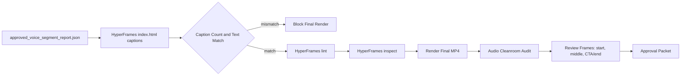

# Auto-Affi Main Flow Mermaid Review

Date: 2026-06-04

Status: upgraded after Hanky 60s Seedance-only test, scene 2 wardrobe failure, location/environment gate, Story Audit gate, Nano Banana Pro static/image-reference lock, `.env`-first provider key management, human-visible pre-generation storyboard gate, and full learning-retrospective loop.

## Current Main Flow

```mermaid
flowchart TD
    A["Viral / News / Social Signals"] --> B{"Ethics and Product-Mapping Gate"}
    B -- "red or unsafe" --> H["Human Review Inbox"]
    B -- "green or approved amber" --> C["Marketing Collection"]
    C --> D["Deep Google / Product / Market Research"]
    D --> DR["deep_product_research.json + visual_reference_board.json + research_synthesis.md"]
    DR --> DRQ{"Research Dense Enough"}
    DRQ -- "thin, contradictory, or low visual evidence" --> H
    DRQ -- "pass" --> E{"Product Truth Pass"}
    E -- "no or unverifiable" --> H
    E -- "yes" --> F["Product Candidate CSV"]
    F --> G["Run Folder and Creative Brief"]

    G --> LKG["Last-Known-Good Success Scenario Review"]
    LKG --> LKGQ{"Follows Hanky V12 Runbook or Approved Deviation"}
    LKGQ -- "missing or unapproved deviation" --> STOP3["Stop and Repair Runbook Drift"]
    LKGQ -- "pass" --> I["Product Truth, Claim Ledger, Rights Tracker"]
    I --> J{"Commercial Safety Pass"}
    J -- "revise or block" --> H
    J -- "pass or publish-block pass" --> K["Creative Strategy, Treatment, Look Bible, Voice Script"]

    K --> L["Location / Environment Design"]
    L --> M{"Realistic World Pass"}
    M -- "revise or block" --> K
    M -- "pass" --> N["Character Sheet and Continuity Bible"]

    N --> O["Storyboard Grid and Shot Cards"]
    O --> P{"Story Audit Pass"}
    P -- "revise or block" --> O
    P -- "pass or publish-block pass" --> Q{"Continuity Audit Pass"}
    Q -- "wardrobe, prop, product, location, or environment jump" --> O
    Q -- "pass" --> R{"Story Physics and Logic Pass"}
    R -- "unrealistic physics or unclear fantasy rule" --> O
    R -- "pass or publish-block pass" --> ENV["Env / Secrets Preflight"]
    ENV --> ENVP{"Required .env Keys Present"}
    ENVP -- "missing required key name" --> STOP0["Stop Provider Route and Record Missing Var"]
    ENVP -- "present, values not printed" --> S["Route Decision"]

    S --> T{"Model Lock Check"}
    T -- "video model is not Seedance 2.0" --> STOP1["Stop and Escalate"]
    T -- "image reference / keyframe / static image is not Nano Banana Pro" --> STOP2["Stop or Regenerate With Nano Banana Pro"]
    T -- "locks pass" --> IMG["Nano Banana Pro Image / Keyframe Gate"]

    IMG --> IMGQ{"Image Reference Pass"}
    IMGQ -- "scripted schematic, rough placeholder, non-Nano image model" --> STOP2
    IMGQ -- "no image needed or Nano/approved source passes" --> U["Prompt Council"]

    U --> V{"Independent Council Pass"}
    V -- "revise or block" --> O
    V -- "pass or publish-block pass" --> HV["Human-Visible Storyboard / Contact Sheet"]
    HV --> HVQ{"Shown and Approved"}
    HVQ -- "not shown / not approved" --> O
    HVQ -- "approved for spend" --> PF["Generation Preflight Validator"]
    PF --> PFD{"generation_allowed true"}
    PFD -- "false" --> O
    PFD -- "true" --> W["Seedance 2.0 Visual Generation"]

    W --> X["Download Source Media Locally"]
    X --> Y["Dailies QC and Contact Sheet"]
    Y --> Z{"QC Decision"}
    Z -- "reject or regenerate" --> AA["Regeneration Plan"]
    AA --> O
    Z -- "use or use with trim" --> AB["Edit Decision List"]

    AB --> AC["Thai Voice / HyperFrames Post"]
    AC --> AD["Audio Cleanroom and Caption Compliance"]
    AD --> AE["Virality Predictor and Performance Snapshot"]
    AE --> AF["Approval Packet"]
    AF --> AG{"Human Approval and Publish Gates"}
    AG -- "not approved or affiliate missing" --> HOLD["Publish Blocked"]
    AG -- "approved and gates pass" --> PUB["Publish Dispatch"]
    PUB --> LEARN["Learning Log, Scorecards, Failure Taxonomy"]
    HOLD --> LEARN
    LEARN --> RETRO["Run Retrospective: Successes, Failures, User-Caught Issues"]
    RETRO --> RULES{"New Workflow Rule Needed"}
    RULES -- "yes" --> UPGRADE["Upgrade Gates, Templates, Skills, Scripts"]
    RULES -- "no" --> ARCHIVE["Archive Run With Evidence"]
    UPGRADE --> ARCHIVE
```



## Required Pre-Generation Gates

```mermaid
flowchart LR
    R0["deep_product_research.json"] --> R1["visual_reference_board.json"]
    R1 --> R2["research_synthesis.md"]
    R2 --> Z["success_scenario_review.json"]
    R0 -. "missing / thin sources" .-> X["No Video Generation"]
    R1 -. "missing visual refs / invalid usage" .-> X
    R2 -. "missing prompt implications" .-> X
    Z -. "missing / block / unapproved deviation" .-> X["No Video Generation"]
    Z --> A["location_environment_design.json"]
    A --> B["storyboard_grid.json"]
    B --> C["shot_cards.json"]
    C --> D["story_audit.json"]
    D --> E["continuity_audit.json"]
    E --> F["story_physics_review.json"]
    F --> ENV[".env loaded and required key names present"]
    ENV --> G["route_decision.json"]
    G --> H["prompt_council_review.json"]
    H --> HR["pre_generation_storyboard_contact_sheet"]
    HR --> UREV["pre_generation_user_review.json"]
    UREV --> I["preflight_generation_gate.json"]
    I --> J["Provider Call Allowed"]

    D -. "draft / revise / block" .-> X["No Video Generation"]
    E -. "unresolved jump" .-> X
    F -. "revise / block" .-> X
    ENV -. "missing required provider var" .-> X
    G -. "not Seedance 2.0 for video" .-> X
    H -. "not pass" .-> X
    HR -. "not rendered or not shown" .-> X
    UREV -. "not approved for spend" .-> X
    I -. "generation_allowed false" .-> X
```



## Required Pre-Final-Render Gates



## Review Findings

- The old weak point was treating storyboard quality as part of prompt quality. It is now a separate `story_audit.json` gate.
- Continuity is no longer only character/wardrobe. It includes product, bag, location, environment, lighting, weather, wet/dry state, and screen direction.
- For realistic affiliate ads, Marketing may not hide broken physics behind style. Fantasy is allowed only when declared and useful to the offer.
- Video generation is locked to `seedance_2_0` only. Other video models are not fallback options.
- Static images, clean product references, keyframes, storyboard imagery, and visual contact sheets that contain generated imagery are locked to `nano_banana_2` / Nano Banana Pro, with OCR/spelling/claim/identity review where relevant.
- Scripted schematic images, rough placeholder drawings, and non-Nano Banana image generations are blocked as production references.
- A storyboard grid that exists only as JSON is not enough. The reviewer must see a 3x3 storyboard/contact sheet and explicitly approve the spend before paid Seedance jobs.
- Final video captions and CTA should still be composed deterministically in post unless explicitly approved otherwise.
- Production provider keys are managed through the project `.env`. Provider calls must load `.env`, verify only variable-name presence, and never print or copy secret values into logs or artifacts.
- Caption/subtitle text must exactly match the approved voice segment report before final render.
- User-caught failures are treated as workflow defects that must add a machine-check, independent review seat, or stronger gate.

## Next Production Rule

Before the next product spends credits, the team must show this chain as pass or pass-with-publish-block:

```text
location_environment_design
storyboard_grid
shot_cards
story_audit
continuity_audit
story_physics_review
env_secrets_preflight
route_decision
prompt_council_review
pre_generation_storyboard_contact_sheet_shown
pre_generation_user_review
preflight_generation_gate
caption_voice_sync_gate
learning_retrospective_closeout
```
