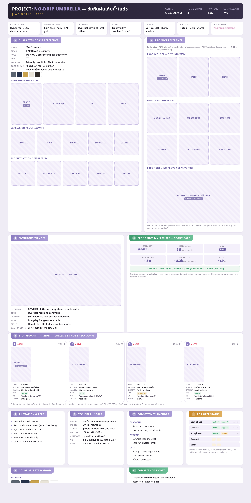
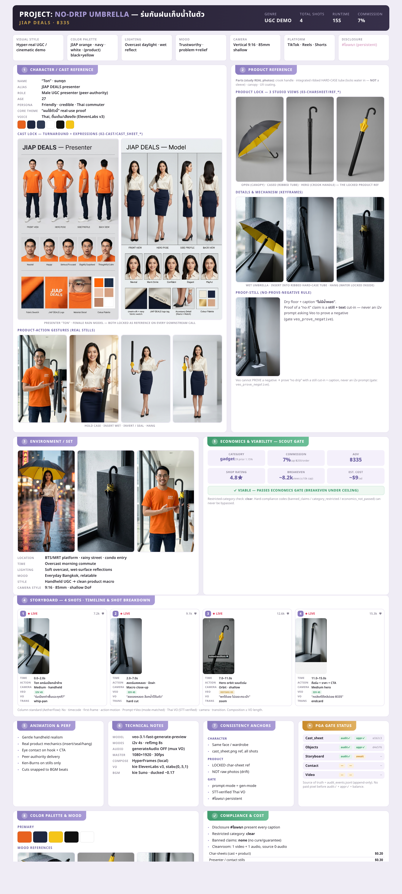

# Auto-Affi Lock Sheet Standard

> One approve-before-spend "bible" per product. Replaces the old **3 separate** artifacts
> (`cast_sheet` + `objects_sheet` + `storyboard.html`) with a single reviewable page — so the
> operator sees the whole locked plan (identity, product, story, gate, economics) at one glance
> before any paid pixel. Template: [lock-sheet-template.html](../templates/lock-sheet-template.html).
> Rendered template (wireframe slots): 
>
> **Fully populated example** (real umbrella-335 assets — cast composites, product refs, keyframes):
>  — produced from `runs/2026-06-30-umbrella-335/lock-sheet.html`
> (the run dir is git-ignored; this rendered PNG is the committed proof).

## Why it exists
The NOVA reference sheet proved the value of a **single-page production bible**. Our pipeline had the
pieces scattered (separate PNGs + a storyboard HTML). This standard unifies them and **adds the three
panels a generic influencer sheet lacks but Auto-Affi requires**: Economics (Scout gate), PGA Gate
Status, and Compliance & Cost. The storyboard block keeps the operator-preferred **AetherFlow column
order**.

## The 11 sections (order is the standard — never drop the Auto-Affi-only three)

| # | Section | Fields (Auto-Affi real vocabulary) |
|---|---------|-----------------------------------|
| — | **Header bar** | `PROJECT: <name>` · brand `JIAP DEALS · ฿<price>` · GENRE · TOTAL SHOTS · RUNTIME · COMMISSION% |
| — | **Meta strip (7)** | Visual Style · Color Palette · Lighting · Mood · Camera · Platform · **Disclosure `#โฆษณา`** |
| 1 | **Character / Cast** | identity (Name/Alias/Role/Age/Persona/Core-theme/Voice) · palette chips · **4 body views** (front/hero/side/back) · **expression progression (5)** · **product-action gestures (5)** — mirrors `02-cast/cast_sheet_*.png` |
| 2 | **Product Reference** | parts callout (study REAL photos) · **3 studio views** open/cased/hero (`03-charsheet/ref_*`) · **details & closeups (6)** mapped to the mechanism · **proof-still** (no-prove-negative) |
| 3 | **Environment / Set** | set plate + Location/Time/Lighting/Mood/Style/Camera-style |
| 4 | **Storyboard (N shots)** | per-shot cards, AetherFlow columns: `No · timecode · first-frame · action·motion · Prompt→Veo (mode chip i2v 4s / refImg 8s) · Thai VO (STT-verified) · camera · transition`; NOVA social motif `LIVE · views · ♥` |
| 5 | **Animation & Perf notes** | movement/realism/eye-contact/Ken-Burns-on-stills/beat-snapped-cuts |
| 6 | **Technical notes** | `veo-3.1-fast-generate-preview` · i2v 4s / refImg 8s · generateAudio **OFF** · master 1080×1920@30 · HyperFrames · kie ElevenLabs v3 (stab∈{0,.5,1}) · kie Suno ducked ~0.17 |
| 7 | **Consistency anchors** | Character (same face, cast_sheet ref) · Product (LOCKED char-sheet, **not raw photos**) · Gate (prompt-mode=gen-mode · STT-verified VO · `#โฆษณา`) |
| **9** | **Economics & Viability** ⓐ | Scout gate: category+CR-prior · commission% (cap ฿200) · AOV ฿ · shop rating · breakeven views (≤10k) · est cost ~$9 · **VIABLE/REJECT verdict** |
| **10** | **PGA Gate Status** ⓐ | 5 stages `cast_sheet→objects_sheet→storyboard→contact_sheet→video` with `audit✓ / appr✓ / hash`; source of truth = `audit_events.jsonl` |
| 8 | **Color Palette & Mood** | primary swatches + mood tiles |
| **11** | **Compliance & Cost** ⓐ | `#โฆษณา` present · restricted-category clear · banned-claims none · cleanroom 1v+1a · cost breakdown table (~$9/ad) |

ⓐ = **Auto-Affi-only** panel (NOVA/influencer sheets don't have these). These are non-negotiable —
they encode our verify-before-spend + compliance contract.

## How it maps to the pipeline (PGA stages)
The lock sheet is the **review artifact** at the reference-sheet + storyboard gates
(`skills/produce-affiliate-video.md` Step 4 / 4.5): fill the sheet → the operator approves it as a
SET → only then do `contact_sheet` + `video` proceed. Each image slot is filled from the matching
generated PNG as stages pass (`02-cast/*`, `03-charsheet/*`, `04-contact/fNN.png`).

## How to produce one
1. Copy `docs/templates/lock-sheet-template.html` to `runs/<run>/lock-sheet.html`.
2. Fill the header/meta/identity/economics text from the product intake + Scout result.
3. As each stage generates, replace the `
…
` boxes with ``
   pointing at the real PNG (aspect classes `.p .s .sq .w`).
4. Keep the storyboard columns in the AetherFlow order; put the Veo **mode chip** (`i2v 4s` /
   `refImg 8s`) on every shot so prompt-mode ≠ gen-mode errors are caught by eye.
5. Render to PNG for the review panel:
   `"<chrome>" --headless=new --force-device-scale-factor=2 --window-size=1080,2160 --screenshot=out.png "file://…/lock-sheet.html"`
   (Thai shapes correctly via Noto Sans Thai `@font-face`; verify tone marks in the render.)

## Non-negotiables
- Never drop sections **9 / 10 / 11** (economics, gate status, compliance) — they're the point.
- Product parts come from the **REAL** photos (the umbrella = crook handle + integrated ribbed
  hard-case tube, **not** a sleeve). Wrong mechanism = wasted run.
- Storyboard Veo mode chip is mandatory (guards `prompt_mode_mismatch`).
- Proof-still panel for any "no-X" claim (guards `veo_prove_negative`).
- See the locked pipeline: [gold-standard-ad-recipe.md](gold-standard-ad-recipe.md).
