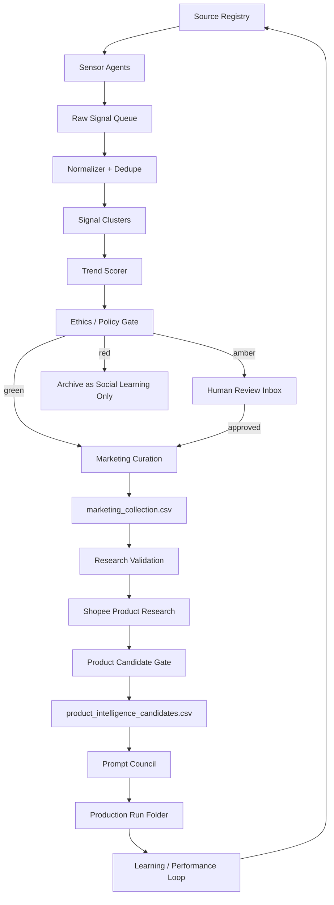

# Auto-Affi 24/7 Subagent Team Blueprint

Date: 2026-06-04

## Intent

ออกแบบทีม subagent ที่ทำงานได้ตลอดเวลาเพื่อหา social/news viral signals, ส่งให้ Marketing เลือก product/angle เข้า collection, ให้ Research ตรวจสอบต่อ, แล้วค่อยส่งต่อให้ Auto-Affi production workflow โดยไม่พึ่งการจำในแชทและไม่ปล่อยให้ agent ใด agent หนึ่งตัดสินใจครบวงจรเอง

หลักคิด:

> Subagents do not "browse forever." They run scheduled sensing loops, write durable records, hand off through queues, and stop at gates they are not allowed to approve.

## System Shape



## Team Units

### 1. Command Center

Owns the global task board and prevents duplicate work. This is the 24/7 shift lead.

Responsibilities:

- keeps `data/subagent_ops_queue.csv` healthy;
- assigns stage owners;
- checks stale tasks;
- escalates blocked items;
- creates daily digest for the human operator.

Cannot:

- approve amber/red sensitive signals;
- publish;
- override claim/compliance gates.

Cadence:

- every 15 minutes: queue health check;
- hourly: unblock/reassign stale work;
- daily: publish digest and top candidate list.

Key tables:

- `data/subagent_ops_queue.csv`
- `data/source_registry.csv`
- `data/human_review_inbox.csv`

### 2. Source Registry Agent

Maintains the list of allowed sources and access method.

Preferred access order:

1. official API;
2. RSS/public feed;
3. saved search/manual review;
4. browser-assisted review by human;
5. no uncontrolled scraping.

Records:

- source name;
- platform;
- source category;
- allowed access method;
- rate limit/quota;
- credential requirement;
- risk level;
- freshness cadence.

### 3. News Desk Agents

Tracks official Thai news, weather, consumer, local events, entertainment, transport, lifestyle, technology, and government signals.

Outputs only rows in `data/viral_signal_intelligence.csv`.

Examples:

- TMD weather warning -> rain commute products;
- transport disruption -> power bank, umbrella, shoe cover, bag organizer;
- entertainment event -> beauty/sleep/fashion routine, without implying endorsement.

### 3B. Thai Culture and Context Agents

Reads Thai nuance, slang, jokes, social sensitivity, and backlash risk.

Jobs:

- explain why a trend matters in Thai culture;
- detect sarcasm, political/social sensitivity, body-shaming, class sensitivity, regional sensitivity, and gender sensitivity;
- recommend a safer angle if the product mapping feels too opportunistic;
- block jokes that could be interpreted as attacking a real person.

### 4. Social Radar Agents

Tracks platform-level viral clues from TikTok, Facebook, Instagram, YouTube Shorts, X, Pantip, Google Search/Trends, and creator chatter where accessible.

Outputs:

- platform;
- source URL or search URL;
- keywords/hashtags;
- engagement snapshot;
- comment themes;
- trend age;
- raw evidence.

Rules:

- capture public trend signals, not private personal data;
- do not store unnecessary personal identifiers;
- do not scrape around platform controls;
- do not impersonate a user or bypass login protections.

### 5. Normalizer + Dedupe Agents

Turns noisy rows into canonical topics.

Jobs:

- merge duplicate links and variants;
- canonicalize keywords;
- identify the core audience need;
- split factual claim vs social interpretation;
- attach confidence score.
- treat repeated viral sightings as potential signal strength, not automatic noise.

Dedupe key:

```text
platform + normalized_topic + source_domain + date_bucket
```

Duplicate policy:

- Exact duplicate rows should not bloat `viral_signal_intelligence.csv`.
- Repeated sightings should be appended to `signal_observations.csv`.
- Repeated sightings can increase `source_count`, `platform_count`, velocity, cluster recency, and Marketing priority.
- Marketing may select a repeated cluster because repetition itself can indicate buyer attention.
- Do not force repeated sightings into one product if the audience need differs.

### 6. Trend Scorer Agents

Ranks opportunities before product mapping.

Recommended score:

```text
trend_score =
  0.20 * freshness
+ 0.20 * velocity
+ 0.15 * thai_relevance
+ 0.15 * audience_pain
+ 0.10 * commerce_fit
+ 0.10 * visual_demo_fit
+ 0.10 * shopee_availability
- 0.25 * harm_risk
- 0.20 * claim_risk
- 0.15 * saturation_risk
```

Scores are routing signals, not approval.

### 7. Ethics / Brand Safety Agents

Classifies every signal:

- `green`: low-risk lifestyle/weather/commute/home/beauty/fashion/tech.
- `amber`: celebrity, scandal, relationship conflict, health-adjacent, public figure, financial stress, allegations.
- `red`: violence, injury, death, minors, self-harm, serious illness, active criminal/legal case, victim suffering, doxxing, humiliation.

Hard rule:

> Red signals cannot become product prompts. They can only become de-identified social learning or broad public-safety ideas after human approval.

### 8. Product Mapping Agents

Maps approved signals and Marketing collection ideas to product categories and Shopee queries.

Output:

- audience need;
- candidate product category;
- product search query;
- allowed claims;
- prohibited claims;
- why now;
- risk notes.

Example:

- celebrity late-night tired look -> `sleep mask`, `cooling eye mask`, `concealer`, `gentle eye cream`;
- do not use celebrity name, image, quote, or implied endorsement.

Unsafe example:

- domestic violence injury -> do not map to bruise cream;
- mark `red_no_product_mapping`.

### 9. Marketing Collection Agents

Own the commercial shortlist before Research starts.

Jobs:

- choose products or product angles from trend clusters, seasonal calendars, direct human ideas, and performance learnings;
- write rows into `data/marketing_collection.csv`;
- define buyer archetype, marketing angle, hook hypothesis, priority, and expected content format;
- tag the source as `viral_signal`, `seasonal_calendar`, `manual_human_pick`, `performance_learning`, or `brand_request`;
- send selected rows to Research with status `selected_for_research`.

Cannot:

- approve factual product claims;
- mark an idea production-ready;
- bypass ethics, compliance, or Research validation.

### 10. Shopee Product Research Agents

Checks real product availability.

Fields:

- product title;
- shop/brand;
- price;
- rating/reviews if visible;
- image refs;
- product URL;
- SKU/variant;
- claim text from listing;
- affiliate readiness;
- product identity anchors.

Cannot:

- generate affiliate links outside approved Shopee Affiliate dashboard/API;
- treat search snippets as final truth;
- use health/medical claims without compliance approval.

### 11. Claims / Compliance Agents

Checks:

- TikTok commercial-content disclosure;
- AI-generated content label when realistic AI media is used;
- affiliate disclosure;
- platform restricted categories;
- Thai FDA/health/cosmetic-adjacent claim risk;
- unsupported performance, safety, medical, delivery, or guarantee claims.

Health-adjacent products default to amber even when the trend looks attractive.

### 12. Creative Strategy Agents

Converts approved product candidate into:

- buyer archetype;
- hook angle;
- human truth;
- product proof beat;
- 15s hook test or 30s commercial master decision.

Cannot approve its own prompt.

### 13. Prompt Council Agents

Independent seats:

- Marketing;
- Product Research / Claims;
- Shooting Production;
- Post / Rights / Compliance.

Output:

- `prompt_council_review.json`;
- density score;
- dissent;
- required revisions;
- final decision.

### 14. Production Router Agents

Creates:

- `route_decision.json`;
- local download plan;
- cost estimate;
- failure triggers.

### 15. Performance Learning Agents

After every generated or published clip:

- stores virality score;
- stores hook performance;
- compares prompt density vs output quality;
- records model/provider behavior;
- updates learning logs and scorecards.

### 16. Knowledge Librarian Agents

Owns dedupe memory and decision history.

Jobs:

- records killed ideas and why they were killed;
- prevents risky ideas from being recycled by another agent;
- links signal clusters to product candidates and run folders;
- maintains source trust, prompt lessons, and product-category performance.

## Durable Storage

Use Google Sheets for human operations and CSV/JSON in repo for durable local source of truth.

Recommended Google Sheet tabs mirror local CSVs:

1. `source_registry`
2. `viral_signal_intelligence`
3. `signal_clusters`
4. `subagent_ops_queue`
5. `human_review_inbox`
6. `product_mapping_queue`
7. `marketing_collection`
8. `product_intelligence_candidates`
9. `production_runs`
10. `learning_metrics`

Local files:

- `data/source_registry.csv`
- `data/viral_signal_intelligence.csv`
- `data/signal_observations.csv`
- `data/signal_clusters.csv`
- `data/subagent_ops_queue.csv`
- `data/human_review_inbox.csv`
- `data/product_need_map.csv`
- `data/marketing_collection.csv`
- `data/product_intelligence_candidates.csv`
- `data/claim_ledger_index.csv`
- `data/run_registry.csv`
- `data/post_publish_results.csv`
- `runs/YYYY-MM-DD-product-slug/...`

## Core Table Contracts

`source_registry`

```text
source_id, platform, source_name, source_category, access_method, cadence_minutes,
freshness_ttl_minutes, quota_per_day, terms_mode, owner_team, enabled, risk_level,
last_checked_at, notes_th
```

`signal_observations`

```text
observation_id, signal_id, observed_at, views, likes, comments, shares, saves,
search_rank, trend_rank, velocity_1h, velocity_6h, sentiment_th,
comment_themes_th, raw_snapshot_json, observer_agent
```

`signal_clusters`

```text
cluster_id, cluster_key, normalized_topic_th, first_seen_at, last_seen_at,
lead_signal_id, source_count, platform_count, max_signal_score,
ethics_color_max, cluster_status, recommended_need_th, blocked_reason_th
```

`product_need_map`

```text
need_id, cluster_id, audience_need_th, safe_angle_th, unsafe_angle_th,
product_category, shopee_query, claim_limits_th, ethics_gate,
mapping_confidence, mapping_status, reviewer
```

`marketing_collection`

```text
collection_id, created_at, updated_at, owner_team, selected_by,
selection_source, signal_id, cluster_id, need_id, product_idea_th,
product_category, shopee_query, marketing_angle_th, buyer_archetype_th,
hook_hypothesis_th, why_marketing_selected_th, priority,
expected_content_format, ethics_color_initial, policy_risk_initial,
claim_risk_initial, research_status, research_owner, candidate_record_id,
collection_status, notes_th
```

`run_registry`

```text
run_id, record_id, cluster_id, run_slug, run_folder, created_at,
creative_profile, run_status, brief_path, approval_packet_path,
route_decision_path, prompt_council_path, final_mp4_path, affiliate_sub_id,
prompt_council_decision, cleanroom_status, virality_score,
human_approval_status, publish_status, learning_status, run_dedupe_key
```

## Queue Lifecycle

```text
captured
-> normalized
-> clustered
-> scored
-> ethics_green | ethics_amber_review | ethics_red_archive
-> product_mapping
-> marketing_collection
-> research_validation
-> product_research
-> candidate_ready
-> prompt_council
-> generation_ready
-> production_done
-> human_review
-> publish_ready | publish_blocked
-> learning_closed
```

Runtime task status:

```text
queued -> leased -> running -> succeeded | failed_retryable | failed_blocked |
deadletter | needs_human_review | expired
```

Primary queues:

```text
ingest_raw_signal
dedupe_cluster
verify_signal
ethics_review
map_need
marketing_select
research_validate_collection
shopee_research
normalize_product
claim_check
score_candidate
generation_input_check
create_run_folder
prompt_council
generate_video
qa_cleanroom
human_approval
publish_dispatch
learning_update
```

## Human Review Policy

Human review is required when:

- ethics color is `amber` or `red`;
- the signal involves a named person, public figure, private individual, child, victim, illness, injury, violence, or allegations;
- the product is health, supplement, cosmetic treatment, medicine, personal safety, finance, legal, or adult;
- an agent wants to use realistic AI people, voice, likeness, or news-like reenactment;
- the angle could look like it monetizes harm.

## Runtime Design

Do not keep one browser open forever. Use scheduled jobs:

- 15-minute sensors for low-cost allowed sources;
- hourly normalize/dedupe/scoring;
- 3 times per day product mapping;
- daily human digest;
- weekly source/policy audit.

Suggested loops:

| Loop | Cadence | Job |
|---|---:|---|
| `source_discovery_loop` | 30 min | fetch official/API/RSS/allowlist signals |
| `queue_dispatch_loop` | 10-30 sec | lease bounded tasks to subagents |
| `heartbeat_watchdog_loop` | 60 sec | detect stale agents and expired leases |
| `rate_budget_refill_loop` | 60 sec | refill source/provider token buckets |
| `freshness_recheck_loop` | 2-6 hr | recheck price, SKU, stock, trend freshness |
| `failure_recovery_loop` | 5 min | retry safe failures, escalate risky failures |
| `daily_digest_loop` | 08:00 ICT | summarize top candidates and human actions |

Each job:

1. reads queues;
2. claims a bounded task;
3. writes structured output;
4. releases the task or marks it blocked;
5. logs errors and next retry time.

## Failure Handling

Failures become rows, not silent misses.

Failure fields:

- `last_error`;
- `retry_count`;
- `next_retry_at`;
- `blocked_reason`;
- `owner_agent`;
- `human_action_needed`.

Circuit breakers:

- source returns auth/rate-limit error 3 times;
- duplicate rows exceed threshold;
- red signals exceed threshold in a source;
- policy page changed;
- CSV/Sheet write fails;
- trend score formula drifts from post-publish performance.

## Agent Heartbeat

Every live worker should write a heartbeat:

```json
{
  "agent_id": "researcher-01",
  "role": "source_research",
  "status": "running",
  "current_task_id": "task_123",
  "last_seen_at": "2026-06-04T08:15:00+07:00",
  "lease_expires_at": "2026-06-04T08:17:00+07:00",
  "rate_budget_remaining": {
    "youtube_data_api": 1200,
    "news_rss": 18
  }
}
```

Watchdog rules:

- no heartbeat for 3 cycles -> mark `stale`;
- expired lease -> requeue only if idempotent;
- agent fails 3 times in 30 minutes -> quarantine;
- publish/review tasks never auto-retry silently.

## Dedupe Keys

`signal_dedupe_key`

```text
source_post_id if available,
else hash(platform_family + canonical_source_url + normalized_topic + date_bucket)
```

`cluster_key`

```text
hash(normalized_topic_th + location_th + demand_window + top_keywords)
```

`product_dedupe_key`

```text
shopee_item_id if available,
else hash(canonical_shopee_url),
else hash(product_title + brand_or_shop + price_thb + image_url)
```

`run_dedupe_key`

```text
hash(record_id + cluster_id + creative_profile + yyyy_mm_dd)
```

## Safety Sidecar

The safety/compliance layer uses `fail-closed`.

If required inputs are missing, the task becomes `amber` or `red` until a human reviewer clears it.

Required inputs:

```text
platform
market_country
product_category
affiliate_or_sponsor_status
claims_list
evidence_links
assets_licensing
ai_generated_flags
people_likeness_flags
sensitive_event_flags
```

Safety output:

```text
GREEN | AMBER | RED
reasons
required_disclosures
platform_labels
blocked_or_rewritten_claims
required_human_reviewer
```

Hard review rules:

- affiliate/commercial relationship unclear -> amber;
- missing affiliate disclosure -> red;
- platform disclosure intentionally bypassed -> red;
- realistic AI media without required label -> red;
- health/cosmetic/supplement treatment claim without evidence -> red;
- celebrity/public-person likeness or voice implying endorsement -> red;
- private person or minor likeness without consent -> red;
- violence, victim, tragedy, or crisis monetization -> red.

Disclosure baseline:

- use platform disclosure tools when available;
- add our own clear disclosure near the product/link;
- AI-generated realistic visuals/voices must have an AI disclosure decision;
- affiliate links need disclosure close to the link and in the caption/description.

Example Thai affiliate disclosure:

```text
โพสต์นี้มีลิงก์ affiliate เราอาจได้รับค่าคอมมิชชันหากคุณซื้อผ่านลิงก์นี้
```

Health/cosmetic-adjacent guardrails:

- low risk: cleanse, moisturize, beautify, fragrance, appearance-only;
- amber: acne, dandruff, anti-aging, wrinkle removal, hair growth, SPF, antibacterial, supplements, sleep/stress aromatherapy;
- red: diagnose, cure, mitigate, treat, prevent disease, guaranteed medical outcome, fake FDA approval.

`Not medical advice` does not repair a prohibited claim.

## External API Notes Checked On 2026-06-04

- YouTube Data API requires a Google project and uses quota limits; default quota is documented as 10,000 units/day and subject to compliance audit for higher quota: https://developers.google.com/youtube/v3/getting-started
- TikTok Research API exposes structured video query fields such as date, region, hashtag, keyword, view count, and comment count, with max result limits per request: https://developers.tiktok.com/doc/research-api-specs-query-videos/
- TikTok branded content and AI-generated media policies still require disclosure/label review before affiliate publishing.
- FTC endorsement guidance says paid/valuable relationships and affiliate-style connections should be clearly disclosed when they may affect consumer evaluation: https://www.ftc.gov/business-guidance/resources/ftcs-endorsement-guides-what-people-are-asking
- FTC health-product guidance and FDA cosmetic-claim guidance are red-flag references for treatment, prevention, cure, and drug-like claims: https://www.ftc.gov/business-guidance/resources/health-products-compliance-guidance and https://www.fda.gov/cosmetics/cosmetics-labeling/cosmetics-labeling-claims
- YouTube's GenAI disclosure help page and TikTok integrity/authenticity guidance should be rechecked before publishing realistic AI media: https://support.google.com/youtube/answer/14328491 and https://www.tiktok.com/community-guidelines/en/integrity-authenticity/

## Implementation Phases

### Phase 1: Manual 24/7 OS Simulation

- Google Sheet tabs + local CSV mirrors.
- Agents run on schedule or manually from Codex.
- Human reviews daily digest.
- No automatic publish.

### Phase 2: Semi-Automated Sensors

- Official/RSS/API sources only.
- Automated scoring and queueing.
- Human approves amber/red and top product candidates.

### Phase 3: Production Auto-Handoff

- Approved green candidates can create run folders automatically.
- Prompt council remains required.
- Publish remains human-gated.

### Phase 4: Performance Feedback

- Published performance updates trend/product/prompt scoring.
- Low-converting categories decay.
- High-quality safe sources gain priority.

## Non-Negotiables

- No uncontrolled scraping.
- No private data harvesting.
- No direct monetization of violence, injury, death, illness, humiliation, or victims.
- No fake endorsement from celebrities/public figures.
- No medical/cosmetic treatment claim without evidence and compliance approval.
- No public publish without human approval, affiliate disclosure, AI label decision, and platform disclosure.
