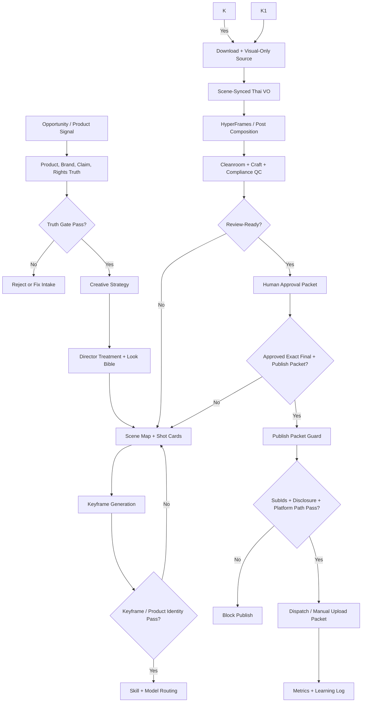

# Auto-Affi Systematic Workflow Upgrade Blueprint

Date: 2026-06-04, Asia/Bangkok

Status: synthesis from current Auto-Affi research, proven production-review runs, and 6 brainstorming sub-agents.

Purpose: upgrade Auto-Affi from a one-shot affiliate video generator into a systematic Hollywood-grade marketing, film, and commercial production workflow.

Related local research:

- [Hollywood-grade marketing and film studio playbook](./hollywood-grade-marketing-film-studio-playbook-th-2026-06-04.md)
- [Hollywood studio research swarm synthesis](./hollywood-studio-research-swarm-synthesis-2026-06-04.md)
- [Production review principle](../principles/2026-06-03-production-review-principle.md)
- [Prompt council principle](../principles/2026-06-04-prompt-council-gate.md)
- [Model routing principle](../principles/2026-06-04-model-routing-principle.md)
- [AI video previsualization principle](../principles/2026-06-04-ai-video-previsualization-principle.md)
- [Story physics and logic review principle](../principles/2026-06-04-story-physics-logic-review-principle.md)
- [Rights and business affairs principle](../principles/2026-06-04-rights-business-affairs-principle.md)
- [Talent and partner principle](../principles/2026-06-04-talent-partner-principle.md)
- [Learning and performance principle](../principles/2026-06-04-learning-performance-principle.md)

## 1. Executive Decision

Upgrade Auto-Affi into a **Workflow OS for cinematic commerce production**.

Auto-Affi should no longer think in the shape:

```text
product -> prompt -> video -> publish
```

It should think in the shape:

```text
opportunity -> product/brand truth -> strategy -> story/treatment -> shot contracts
```

The operating thesis:

> Product truth + human truth + cinematic craft + rights discipline + measurable performance.

The routing thesis:

> Skill chooses the workflow. Model renders the media. Human QA approves the truth.

This preserves the current hard-won Auto-Affi rules:

- 30s commercial master is the default for Thai spoken affiliate review ads.
- Generated visuals are silent B-roll by default.
- Final Thai VO is separate, scene-synced, and composed in post.
- Final MP4 must pass cleanroom verification.
- Thai captions, CTA, price, and disclosure are composited in post, not model-generated.
- Review-ready is never publish-ready.
- Public posting requires explicit human approval, valid affiliate subIds, disclosure gates, and verified platform path.

## 2. The New Mental Model

The current system already has strong ingredients: product scout CSV, creative brief, generated media, Thai voice workflow, final MP4, cleanroom verification, approval packet, and learning notes.

The upgrade is to separate the system into clear layers:

| Layer | Purpose | Core Output |
| --- | --- | --- |
| Opportunity | Find timely demand, product fit, brand brief, trend context | `project_intake.json`, CSV candidate |
| Truth | Verify product, brand, claim, rights, and platform reality | `product_truth.json`, `claim_ledger.json`, `rights_tracker.json` |
| Strategy | Convert product need into human tension and business goal | `creative_strategy.md` |
| Cinematic Control | Build story, treatment, shot cards, keyframes, prompt contracts | `director_treatment.md`, `shot_cards.json`, `prompt_pack.jsonl` |
| Previsualization | Lock character/object anchors, 3x3 storyboards, continuity, and dailies criteria before motion | `character_sheet.json`, `continuity_bible.json`, `storyboard_grid.json`, `dailies_qc.json` |
| Story Physics and Logic | Check reality mode, gravity, weight, water, cause/effect, and fantasy-rule consistency | `story_physics_review.json` |
| Prompt Council | Multi-team debate, density review, non-self-approval | `prompt_council_review.json`, council-reviewed prompt packs |
| Post | Voice, captions, edit, sound, color, output format | `hyperframes_manifest.json`, `render_manifest.json` |
| Rights and Business Affairs | Claims, releases, AI consent, affiliate, disclosure | `rights_tracker.json`, `business_affairs_review.json`, publish packets |
| QA and Approval | Stop bad facts, bad craft, rights risk, and publish mistakes | `verification.json`, `approval_packet.json` |
| Publish | Dispatch only approved publish packets | `publish_packet.json`, `dispatch_log.jsonl` |
| Talent and Partners | Decide internal vs partner craft ownership | `talent_partner_plan.json` |
| Learning | Feed performance, cost, revision causes, and craft notes back into routing | `metrics/performance_snapshot.json`, `metrics/learning_log.md` |

## 3. System Stages

### Stage 0: Intake and Profile Router

Ask first: what kind of work is this?

Profiles:

| Profile | Use When | Default Duration | Default Output |
| --- | --- | ---: | --- |
| `thai_affiliate_30s_master` | Shopee/TikTok affiliate product review | 30s | 9:16 final MP4 plus publish packet |
| `thai_affiliate_15s_cutdown` | Hook/CTA test after 30s master is approved | 15s | 9:16 cutdown |
| `premium_brand_commercial` | Client/brand cinematic ad | 30s, 60s, 90-120s | treatment, hero film, cutdowns |
| `product_broll_pack` | Cinematic product B-roll for future edits | 5-30s clips | shot pack |
| `static_marketplace_pack` | Shopee/listing/social stills | N/A | image pack |
| `source_video_adaptation` | User provides source video/timeline/reference | matches source | adapted video |
| `case_film_or_awards` | Campaign recap, PR, award entry | variable | case film kit |

Gate:

- Reject if no real product, brand, source video, or story opportunity exists.
- Require target platform, market, language, product/source URL, and intended approval owner.

### Stage 1: Opportunity and Product Intelligence

For affiliate work, keep Thai-news-first scouting.

Inputs:

- Thai weather/news/event/seasonal signal.
- Product URL or Shopee candidate row.
- Brand URL if client work.
- Source video if adaptation.
- Campaign objective and target platform.

New fields to add after product scout:

```text
buyer_archetype_th
daily_pressure
human_truth_th
external_conflict
internal_friction
stakes
product_role_in_story
proof_moments
must_show_product_surfaces
visual_drift_risks
```

Example:

```text
Weak framing: "rain item"
Stronger framing: "Bangkok commuter wants to arrive presentable despite wet pavement"
```

Gate:

- Thai source required unless planned seasonal/mega-sale record.
- Product must be allowed, timely, and traceable.
- Do not exploit disasters with fear language.

### Stage 2: Product, Brand, Claim, and Rights Truth

Create the truth layer before any expensive generation.

Required artifacts:

- `product_truth.json`
- `brand_brief.json` when brand/client exists
- `claim_ledger.json`
- `rights_tracker.json`
- `ai_usage_log.json`
- `business_affairs_review.json` when client, talent, paid media, likeness, music, or regulated categories are involved

Product truth fields:

```text
product_url
seller_or_brand
sku_variant
price_checked_at
observed_price_thb
product_images
shape_color_scale_notes
allowed_claims
forbidden_claims
fragile_identity_notes
product_remove_risk
```

Claim ledger fields:

```text
claim_id
script_or_visual_source
claim_text_th
claim_type
evidence_url_or_asset
risk_level
approval_status
legal_notes
```

Rights tracker fields:

```text
asset_id
asset_type
owner
license_or_release
territory
term
media
AI_training_allowed
voice_or_likeness_scope
expiry
notes
```

Gate:

- Any unsupported claim blocks publish.
- Any unclear voice, likeness, music, source video, font, stock, or client asset right blocks publish.
- Any regulated category gets compliance review before creative generation.

### Stage 3: Creative Strategy

Create `creative_strategy.md`.

Template:

```text
Human truth:
Buyer archetype:
Situation:
Visible want:
Obstacle:
Stakes:
Product-enabled decisive action:
Brand/product role:
Brand remove test:
Allowed proof:
Forbidden claims:
Final memory image:
Success metric:
```

Gate:

- If the product can be removed and the story still works, rewrite.
- If the strategy is only "make it viral", run trend/source research first.
- If it cannot explain why the viewer cares in Thai cultural context, revise.

### Stage 4: Concept, Script, and Scene Map

Default 30s commercial master structure:

```text
0-3s: thumb-stop image or problem
3-8s: human situation
8-15s: product/story turn
15-25s: proof or emotional payoff
25-30s: CTA / brand / disclosure path
```

Create:

- `script_th.md`
- `scene_map.json`
- `voice_script_th_scene_sync.md`
- `caption_pack.json`

Scene map fields:

```text
idx
start
end
visual_goal
visual_action
product_anchor_asset
voice_th
caption_th
approved_claim_ids
risk_notes
safe_caption_zone
```

Gate:

- No one-long narration unless the whole clip is static.
- No line should require speed above `1.15x`.
- Warning above `1.08x`.
- If speech is crowded, rewrite or use a longer master. Do not rush Thai VO.

### Stage 5: Mini Director Treatment and Look Bible

Create `director_treatment.md`.

Fields:

```text
human truth
logline
tone
performance direction
world/location
product as actor
camera/lens logic
lighting philosophy
edit rhythm
sound/VO direction
caption strategy
non-negotiables
risks
```

Create `look_bible.md`.

Fields:

```text
aspect ratio
lens family
camera language
lighting motivation
contrast
palette
texture
grade direction
reference ads/films
do_not_use
```

Gate:

- "Cinematic" must mean clearer story and stronger product memory, not random luxury styling.
- Default stance for Thai affiliate is **cinema-in-UGC**, not glossy cinema that destroys trust.

### Stage 5b: AI Video Previsualization and Continuity Pack

Use this stage for any run with more than one generated AI video shot.

Create:

- `character_sheet.json`
- `continuity_bible.json`
- `storyboard_grid.json`
- `dailies_qc.json`
- `regeneration_plan.json`
- `metrics/failure_taxonomy.json`

The rule:

```text
Do not ask a video model to invent continuity. Give it continuity to render.
```

Required anchors:

```text
character anchors
product/object anchors
color drift blockers
wardrobe/surface/scale anchors
location/world anchors
reserved naming suffixes
close-up identity policy
```

Storyboard rule:

```text
30s commercial = one 3x3 board
3-minute film = multiple 3x3 boards by act or sequence
```

Each storyboard cell must specify:

```text
CAM
MOVE
MOOD_STYLE
story_function
must_keep
must_avoid
model_hint
```

Gate:

- No long-batch generation without a reviewed storyboard grid.
- No identity-sensitive close-up without approved character/object anchors.
- No final pass without `model_lock_policy: seedance_2_0_only_all_video_shots`.
- If a motif color drifts, update negative constraints before the next batch.
- Shot IDs must not end in reserved post suffixes such as `_silent`, `_raw`, `_final`, `_proxy`, or `_approved`.

### Stage 5c: Story Physics and Logic Review

Create:

- `story_physics_review.json`

This team checks whether the storyboard obeys the intended reality mode before video generation.

Reality modes:

```text
realistic
stylized
fantasy
surreal
```

Rules:

- If Marketing wants a normal product/review story, gravity, object weight, water behavior, hand/body mechanics, object scale, and cause/effect must be realistic.
- If Marketing wants fantasy, the storyboard must include a written fantasy rule and business reason.
- Fantasy can break gravity only when it is intentional, consistent, and does not imply unsupported product claims.
- The reviewer must distinguish intentional fantasy from accidental model failure.

Required checks:

```text
gravity
weight
balance
friction/contact
water/fluid behavior
object scale
hand/body mechanics
camera physicality
cause and effect
screen direction
transition logic
product-use plausibility
claim implication
viewer comprehension
```

Gate:

- No provider call when `story_physics_review.decision` is `revise` or `block`.
- Normal commercial/product demos cannot use floating, teleporting, impossible water behavior, or impossible product functions unless Marketing has approved `reality_mode: fantasy`.
- Fantasy storyboards cannot proceed without a written `fantasy_rule`.

### Stage 6: Shot Cards and Keyframe Gate

Create `shot_cards.json` or `shotlist.csv`.

Fields:

```text
shot_id
script_beat
duration
emotional_function
shot_size
angle
lens_feel
camera_move
move_reason
subject_action
product_visibility
product_surface_to_show
lighting_recipe
safe_caption_zone
generation_model
human_fallback
```

Before video, create still candidates for important shots.

Keyframe gate checks:

```text
product shape
product color
product scale
logo_or_label_accuracy
Thai_context_authenticity
caption_safe_space
continuity
no_false_product_function
```

Naming rule:

```text
SHOT_010_REF_A_APPROVED
SHOT_020_REF_B_REJECT_PRODUCT_DRIFT
```

Gate:

- Do not animate a shot if the keyframe makes the product materially different.
- Product identity beats visual beauty.

### Stage 7: Prompt Council Gate

Create `prompt_council_review.json` before any expensive generation.

The draft owner may write a prompt but cannot approve it. A prompt must be discussed by independent teams:

| Council seat | Must challenge |
| --- | --- |
| Marketing | buyer, hook, positioning, conversion, offer clarity |
| Product Research / Claims | product truth, identity anchors, price/SKU, claim evidence |
| Shooting Production | shot contract, actor action, camera, lighting, continuity |
| Post / Rights / Compliance | cleanroom audio, captions, Thai text, rights, disclosure, AI label |

Prompt density threshold:

```text
affiliate/social review: >= 85
premium brand commercial: >= 90
client/regulated work: >= 95
```

Required decision values:

```text
pass_for_generation
pass_with_publish_block
revise
block
```

Gate:

- At least three independent seats must pass.
- Product Research and Post/Compliance are mandatory pass seats for commercial work.
- Any block from Product Research, Rights, or Compliance blocks generation.
- If the prompt is not dense enough, return `revise` or `block`.
- The drafting team must not self-approve.
- Record dissent and required revisions before generation.

### Stage 8: Skill and Model Routing

Use this canonical route:

```text
Input signal -> lead marketplace skill -> product/brand truth
```

Lead skill selection:

| Input / Desired Output | Lead Skill | Primary Route |
| --- | --- | --- |
| Product URL/photo to affiliate video | Product Analyzer, Marketing Studio Director | shot contracts, then `seedance_2_0` |
| Brand URL to commercial | Brand Analyzer, Creative Strategy, Director Treatment | keyframes, then `seedance_2_0` |
| Product still/listing pack | Product Analyzer, Product Photography Brief, Static Ads | `product-photoshoot`, `marketplace-cards`, `gpt_image_2` |
| Cinematic product B-roll | B Roll Shot Planner, Cinematic Motion Language | keyframes, then `seedance_2_0` |
| Source video adaptation | Video Adapt | source timeline analysis, then controlled render |
| UGC model replacement | UGC Model Swap | source-aware replacement |
| Talking head / presenter | Talking Head Director, Soul ID only with rights | presenter route plus post VO |
| Final scoring | Virality Predictor / Brain Activity | `brain_activity` on final MP4 |

Model routing ladder:

| --- | --- | --- |
| Product UGC/review video | `seedance_2_0` only | no visual-video fallback |
| Cinematic B-roll | `seedance_2_0` only | no visual-video fallback |
| Premium hero moment | `seedance_2_0` only | no visual-video fallback |
| Product/keyframe still | `gpt_image_2`, `nano_banana_2`, `cinematic_studio_2_5` | Imagen, Seedream, Flux |
| Product cleanup | `image_background_remover`, `nano_banana_2` | Recraft, Seedream edit |
| Listing pack | `marketplace-cards` | still/edit fallback |
| Reframe | `reframe` | manual/ffmpeg fallback |
| Video cutout | `sam_3_video` | fallback only if needed |

Rules:

- `brain_activity` is a ranking signal, not approval.
- `topaz_video` is after visual lock, not a way to rescue bad direction.
- Generated visual video must use `seedance_2_0` only. If Seedance 2.0 is blocked or fails after constrained retries, stop and escalate instead of routing to another video model.
- Download every provider output immediately into the run folder.
- Create `route_decision.json` before the first provider call.
- Record route reason, stop/escalation ladder, provider task IDs, cost estimate, and durable local outputs.

### Stage 9: Prompt Packs and Generation Jobs

Create prompt packs as shot contracts, not vibe paragraphs.

`prompt_pack.jsonl` fields:

```text
prompt_pack_id
variant_id
stage
provider
model
params
product_truth_refs
scene_prompts
negative_prompt
claim_guardrails
no_generated_thai_text
expected_outputs
prompt_council_review_path
density_score
council_decision
```

`generation_jobs.jsonl` fields:

```text
job_id
provider
model_or_tool
route_reason
input_assets
prompt_hash
request_payload_path
status
provider_task_id
output_url
durable_local_path
cost_estimate
cost_actual
failure_reason
created_at
completed_at
```

Gate:

- No prompt may be sent to generation until `prompt_council_review.json` records a pass decision.
- Prompt owner cannot be counted as an approver.
- If a prompt lacks human tension, product identity anchors, shot action, claim map, negative prompt, safe caption zones, audio policy, and fallback rule, it is not dense enough.
- Every generation must have route reason, prompt path, task ID, durable local download, and failure note if any.
- No untracked provider CDN URL should become the final source of truth.

### Stage 10: Thai Voice, Captions, Sound, and Post

The proven production path:

```text
scene contract -> silent visual source -> Thai VO per scene -> one VO bed
-> captions/CTA/disclosure in post -> final MP4 -> cleanroom report
```

Audio route:

2. Other production routes: Google Chirp 3 HD Thai, Botnoi, human VO.
3. Draft only: Edge Thai voices such as `th-TH-PremwadeeNeural`.

Voice bed rules:

- Preferred speed: `1.0x`.
- Warning: above `1.08x`.
- Hard reject: above `1.15x`.
- Export one intentional VO/audio bed.
- Keep audio manifest with raw segment durations and speed factors.

Caption rules:

- Thai captions are composited in post.
- Captions must not cover product, price, proof, CTA, or disclosure.
- Do not ask image/video models to draw Thai text.

Sound/music rules:

- `sound_mix_plan.md` before final.
- Music/SFX license must be recorded.
- Temp generative music is allowed for exploration, but publish requires verified rights.
- Final render still has exactly one audio stream.

HyperFrames/Remotion-style post contract:

```text
visual-only video: muted
audio bed: one intentional track
scene JSON: deterministic timing
captions: post-composited
review frames: hook, proof, price/CTA, ending
```

Gate:

- `npx hyperframes lint` / inspect when HyperFrames is used.
- ffprobe cleanroom check before approval packet can move to `ready_for_review`.

### Stage 11: QA, Compliance, and Stop-The-Line Gates

Core rule:

> Review-ready is never publish-ready.

Severity:

```text
green = pass
amber = fix before publish
red = hard block
black = counsel required
```

Stop-the-line gates:

| Gate | Owner | Hard Block |
| --- | --- | --- |
| G0 Jurisdiction/category | Producer + compliance | Unknown market/platform/regulated category |
| G1 Product truth | Product lead | SKU, seller, price, color, size, material, function, packaging, or identity mismatch |
| G2 Claim ledger | Compliance + copy | Any claim lacks evidence |
| G3 Rights clearance | Business affairs | Missing license/release/consent |
| G4 Prompt council | Multi-team council | Prompt lacks density, independent approval, product truth, or shot contract |
| G4b AI/likeness safety | Legal + producer | Voice clone, face swap, digital replica, training use without consent |
| G5 Route decision | Producer + AI director | No route reason, fallback ladder, or local-download plan |
| G6 Craft/technical QC | Post supervisor | Bad captions, product drift, audio bleed, multiple audio streams, rushed VO |
| G7 Disclosure | Compliance + platform owner | Affiliate/material connection disclosure missing or unclear |
| G8 Human approval | Final approver | No named human approved exact final asset and publish packet |
| G9 Dispatch verification | Distribution lead | Wrong link/subId/account/caption/platform toggle/region |
| G10 Learning/performance | Growth lead | No learning log, scorecard, or post-publish monitor plan |

Hard fails:

```text
product identity drift
unapproved claim
generated Thai/legal text
prompt self-approval
missing route decision
source audio bleed
rushed VO above guardrail
missing disclosure gate
affiliate URL or publish path unresolved
voice/likeness/music/source-video rights unclear
```

Cleanroom verification:

```text
raw generated video audio streams = 0, or stripped before final
visual-only source audio streams = 0
final audio streams = 1
final video streams = 1
duration ~= selected profile
voice speed guard errors = []
```

## 4. Standard Run Folder

Recommended run folder:

```text
runs/YYYY-MM-DD-product-slug/
  run.json
  state.json
  artifact_index.json
  product_intake.json
  product_truth.json
  brand_brief.json
  claim_ledger.json
  rights_tracker.json
  ai_usage_log.json
  route_decision.json
  talent_partner_plan.json
  creative_strategy.md
  director_treatment.md
  look_bible.md
  scene_map.json
  character_sheet.json
  continuity_bible.json
  storyboard_grid.json
  story_physics_review.json
  shot_cards.json
  prompt_council_review.json
  dailies_qc.json
  regeneration_plan.json
  clip_inventory.json
  edit_decision_list.json
  caption_pack.json
  approval_packet.json
  README.md

  assets/product/
  assets/source_refs/
  assets/keyframes/

  prompt_packs/
    visual.prompt-pack.jsonl
    visual.v002.council-reviewed.prompt-pack.jsonl
    voice.prompt-pack.jsonl
    caption.prompt-pack.jsonl

  payloads/
    visual/
    voice/
    virality/

  jobs/
    visual_jobs.jsonl
    voice_jobs.jsonl
    virality_jobs.jsonl

  variants/
    v001-local-draft/
      render_manifest.json
      verification.json
      final.mp4
      source_raw.mp4
      source_visual_only.mp4
      voice_bed.wav
      review_frames/

    v002-production/
      render_manifest.json
      verification.json
      final.mp4
      source_raw.mp4
      source_visual_only.mp4
      voice_bed.wav
      review_frames/

  publish/
    tiktok_publish_packet.json
    shopee_affiliate_link_request.json
    shopee_video_packet.json
    dispatch_log.jsonl

  metrics/
    performance_snapshot.json
    learning_log.md
    model_scorecard.md
    prompt_scorecard.md
    failure_taxonomy.json
    prompt_council_failure_log.md
```

Key separation:

- `state.json` is operational state.
- `render_manifest.json` is how a variant was made.
- `verification.json` is technical/craft proof.
- `approval_packet.json` is the human decision surface.
- `publish_packet.json` is the exact publish instruction.

Do not let `approval_packet.json` become the control plane, manifest, status store, and publish packet all at once.

## 5. Core Data Contracts

### `run.json`

```json
{
  "schema_version": "1.0",
  "run_id": "",
  "run_dir": "",
  "created_at": "",
  "timezone": "Asia/Bangkok",
  "product_slug": "",
  "candidate_record_id": "",
  "workflow_profile": "thai_affiliate_30s_master",
  "target_platforms": ["tiktok", "shopee_video"],
  "status": "draft"
}
```

### `state.json`

```json
{
  "current_stage": "intake_ready",
  "active_variant_id": null,
  "blocked": false,
  "blockers": [],
  "next_actions": [],
  "gates": {},
  "updated_at": ""
}
```

Normalized stages:

```text
draft
intake_ready
truth_verified
strategy_ready
treatment_ready
shot_cards_ready
keyframes_approved
visual_generated
voice_generated
composed
verified
ready_for_review
approved
revise
rejected
publish_ready
published
learning_recorded
```

### `approval_packet.json`

Human-facing, compact, and exact:

```json
{
  "run_id": "",
  "status": "ready_for_review",
  "active_variant_id": "",
  "product": {
    "title": "",
    "url": "",
    "seller": "",
    "sku_variant": "",
    "price_checked_at": ""
  },
  "creative": {
    "final_mp4": "",
    "source_visual": "",
    "voiceover": "",
    "review_frames": "",
    "virality_score": null,
    "audio_cleanroom": {}
  },
  "claims": {
    "claim_ledger_path": "",
    "forbidden_claims": [],
    "status": "pass"
  },
  "caption": {
    "th": "",
    "hashtags": ["#โฆษณา", "#affiliate"],
    "on_media_disclosure": true,
    "platform_disclosure_required": true,
    "ai_label_required": true
  },
  "affiliate": {
    "url": "",
    "sub_ids": ["", "", "", "", ""]
  },
  "publish_targets": {},
  "gates": {},
  "risks": [],
  "approval": {
    "status": "pending",
    "approved_by": "",
    "approved_at": "",
    "notes_th": ""
  }
}
```

### `publish_packet.json`

Publish only after approval.

Required checks:

```text
approval.status == approved
final asset checksum matches approved packet
affiliate_url exists
subIds exist
caption exists
disclosure plan exists
platform account verified
privacy/public setting verified
commercial content toggle handled
AI label handled when required
```

SubId taxonomy:

```text
subId[0] = platform
subId[1] = account
subId[2] = product
subId[3] = campaign
subId[4] = variant
```

## 6. Metrics and Learning Loop

Auto-Affi should learn from three types of signal:

1. Craft and approval signal.
2. Platform performance signal.
3. Business conversion signal.

Capture:

```text
hook_score
brain_activity_score
story_score
product_necessity_pass
product_accuracy_score
audio_cleanroom_pass
claim_safety_pass
rights_clearance_pass
human_approval_status
revision_count
revision_reason
route_used
model_used
provider_cost
generation_latency
time_to_first_draft
time_to_approval
publish_platform
publish_account
subIds
views
watch_time
completion_rate
CTR
orders
CVR
commission
revenue
ROI
post_publish_issues
```

Learning decisions:

| Result | Action |
| --- | --- |
| High approval, high CTR, low conversion | Improve product/offer fit |
| High virality, product drift | Keep pattern but tighten product identity gate |
| Low approval, strong product truth | Improve treatment/shot craft |
| Strong conversion, weak craft score | Build fast affiliate version, not premium film |
| Repeated workflow succeeds 3 times | Create Auto-Affi custom skill |
| Repeated failure by route/model | Lower route priority or add constraint |

Weekly review artifacts:

- `metrics/performance_snapshot.json`
- `metrics/learning_log.md`
- `metrics/model_scorecard.md`
- `metrics/prompt_scorecard.md`
- `metrics/product_category_scorecard.md`
- `metrics/prompt_council_failure_log.md`

## 7. Talent, Company, and Review Rituals

To become a Hollywood-grade marketing and film company, Auto-Affi needs a lean core plus an elite network.

Lean core:

| Role | Owns |
| --- | --- |
| Executive Producer / Founder | opportunity, budget, approvals, client/studio direction |
| Creative Strategy Lead | human truth, brand role, campaign architecture |
| AI Film Director | treatment, shot language, generation direction |
| Producer / Production Manager | schedule, run folders, providers, costs, vendor coordination |
| Cinematography / Prompt Director | shot cards, lighting, keyframes, motion prompts |
| Post Supervisor | edit, sound, captions, color, cleanroom verification |
| Business Affairs / Compliance | claims, rights, disclosures, AI consent, publish blocks |
| Growth / Analytics Lead | subIds, dashboards, experiments, learning loop |

Elite network:

- Commercial director advisors.
- Directors of photography.
- Editors.
- Colorists.
- Sound designers.
- Production designers.
- VFX/AI supervisors.
- Talent/casting contacts.
- Thai production partners.
- Legal/business affairs counsel.

Review rituals:

| Ritual | Cadence | Purpose |
| --- | --- | --- |
| Daily opportunity review | daily | choose timely products/briefs |
| Treatment review | per project | approve human truth and story |
| Frame review | per variant | approve product identity and look before motion |
| Dailies review | per render batch | reject bad motion early |
| Audio review | per final candidate | Thai voice, pacing, mix, rights |
| Final cut review | per deliverable | approve exact final asset |
| Publish go/no-go | per publish packet | ensure review-ready becomes publish-ready |
| Postmortem | weekly | turn results into reusable playbooks |

Recruiting rule:

> Legends care less about "we use AI" and more about whether the system protects taste, authorship, rights, quality, and meaningful work.

First outreach should offer:

- A tight cinematic-commerce thesis.
- A short proof reel.
- A clear role: advisor, craft reviewer, director treatment collaborator, or production partner.
- A fair rights/compensation model.
- A promise that AI is used as production acceleration, not a way to erase craft ownership.

## 8. Implementation Backlog

### P0: Workflow Spine

1. Create schema files for `run`, `state`, `product_truth`, `scene_map`, `prompt_pack`, `render_manifest`, `verification`, `approval_packet`, and `publish_packet`.
2. Add `artifact_index.json` to every run.
3. Normalize `state.json` stages and blockers.
4. Make `approval_packet.json` human-facing only.
5. Move variant outputs into `variants/<variant_id>/`.
6. Add cleanroom verifier command that writes `verification.json`.
7. Add publish blocker requiring approved packet, affiliate URL, subIds, disclosure, and platform path.
8. Add prompt council blocker requiring `prompt_council_review.json` before generation.
9. Add route decision blocker requiring `route_decision.json` before provider calls.
10. Add previsualization blocker requiring character/object anchors and `storyboard_grid.json` before multi-shot generation.
11. Add dailies QC blocker requiring `dailies_qc.json`, contact sheet, and `regeneration_plan.json` before a second long batch.
12. Add story physics blocker requiring `story_physics_review.json` before provider calls.
10. Add learning blocker requiring metrics artifacts before archive.

### P1: Creative and Routing

1. Add `creative_strategy.md`, `director_treatment.md`, `look_bible.md`, and `shot_cards.json` templates.
2. Add Seedance-only visual-video router:
   - product ad
   - static pack
   - B-roll
   - source adaptation
   - post utility
3. Add Seedance 2.0 shot-contract brief builder with provider-audio stripping.
4. Add keyframe approval gate.
5. Add prompt council templates:
   - `prompt_council_review.json`
   - marketing reviewer
   - product/claims reviewer
   - shooting production reviewer
   - post/rights/compliance reviewer
6. Add prompt-pack templates:
   - `thai_ugc_30s_seedance_2_0_visual.jsonl`
   - `thai_ugc_30s_kie_elevenlabs_voice.jsonl`
   - `thai_static_shopee_card_pack.jsonl`
7. Add `brain_activity` score capture on final composed MP4.
8. Add model/prompt scorecard updates after each generated variant.

### P2: Learning and Studio Scale

1. Add metrics snapshots and model/prompt scorecards.
2. Add postmortem template and weekly learning review.
3. Add talent/partner CRM fields.
4. Add rights tracker and AI usage log to every premium/client project.
5. Add custom Auto-Affi skills after any workflow repeats successfully 3 times.
6. Add human review dashboard once schemas stabilize.

## 9. 30 / 60 / 90 Day Roadmap

### Days 1-30: Stabilize The Spine

- Implement run folder and schema contracts.
- Convert one existing shoe-cover or umbrella run into the new folder structure manually as a migration example.
- Build cleanroom verifier.
- Build approval packet v2.
- Build publish packet guard.

Definition of done:

```text
One product can move from intake to ready_for_review with clean artifacts,
and cannot move to publish_ready unless approval, subIds, disclosure, and cleanroom pass.
```

### Days 31-60: Add Cinematic Control

- Add story strategy, director treatment, look bible, shot cards, and prompt packs.
- Add keyframe approval gate before video.
- Run 3 products through 30s master workflow.
- Compare Seedance 2.0 shot-contract variants, not different video models.
- Begin weekly model/prompt scorecard.

Definition of done:

```text
Auto-Affi can produce reviewable 30s Thai affiliate masters
that are story-led, product-accurate, cleanroom-verified, and route-logged.
```

### Days 61-90: Build Studio Memory

- Add performance tracking with affiliate subIds.
- Add post-publish monitoring and learning log.
- Create first custom Auto-Affi house skill from a repeated successful workflow.
- Build proof reel and case-film template.
- Start advisor/partner outreach with one clear proof package.

Definition of done:

```text
The system knows which product categories, story patterns, skills, models,
voices, and prompt contracts are actually producing approval and conversion.
```

## 10. Mermaid Workflow



## 11. Bottom Line

The upgrade is not to add more agents or more models.

The upgrade is to make Auto-Affi think like a studio:

```text
Truth first.
Story second.
Shot contracts third.
Thai post-production makes it publishable.
QA protects the business.
Human approval controls the final jump.
Metrics make the next run smarter.
```

This is the bridge from one product video to a repeatable Hollywood-grade cinematic commerce company.
