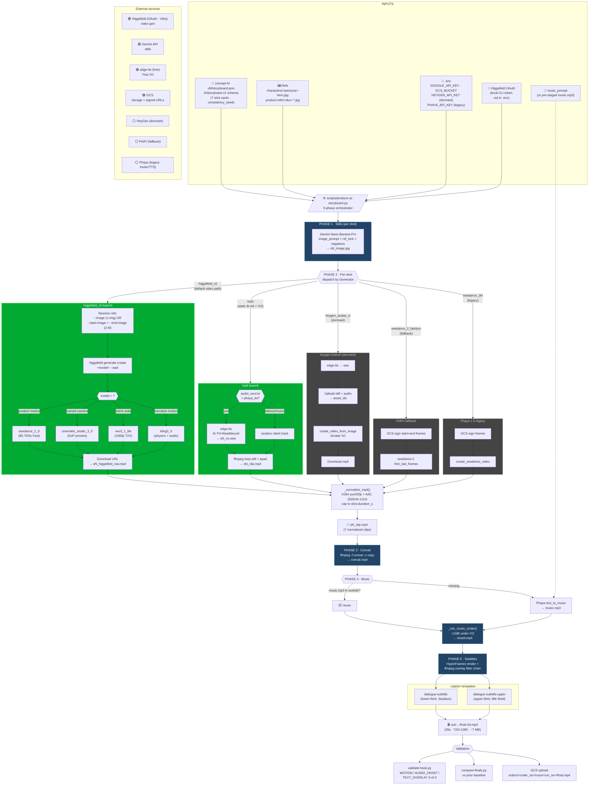
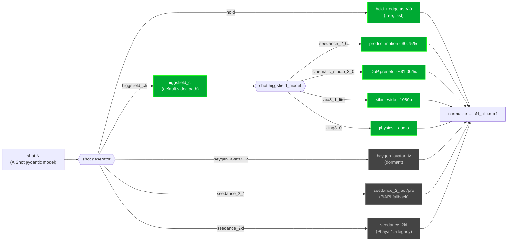

# Auto-Affi Pipeline — Current Workflow (v13, 2026-05-17)

This is the reference diagram for the production pipeline as it stands
after concept-2-v5 / final v13 shipped. The workflow is **Higgsfield-only
for all video generation**; HeyGen / PiAPI / Phaya legacy branches are
preserved in code as dormant fallbacks.

Source-of-truth artifacts:
- Orchestrator: [`scripts/produce-ai-storyboard.py`](../scripts/produce-ai-storyboard.py)
- Schema: [`src/auto_affi/schemas/ai_storyboard.py`](../src/auto_affi/schemas/ai_storyboard.py)
- Higgsfield adapter: [`src/auto_affi/adapters/higgsfield_cli.py`](../src/auto_affi/adapters/higgsfield_cli.py)
- Storyboard example: `data/registry/items/<item_id>/concept-N-vM/storyboard.json` (gitignored — per-product)
- Routing decision: [`.aegis/brain/learnings/2026-05-16-higgsfield-only-workflow-plan.md`](../.aegis/brain/learnings/2026-05-16-higgsfield-only-workflow-plan.md)

## Per-shot decision flow (the inner loop)

Every shot in the storyboard goes through Phase 2's router once. The
flow inside one shot:

## Cost model (28s · 7-shot ad)

| Layer | Per ad | Source |
|---|---|---|
| Higgsfield Seedance 2.0 Fast (5 motion shots × ~$0.65) | ~$3.30 | Ultra plan: $129/3000 credits = $0.043/credit |
| Gemini Nano Banana Pro stills (7) | ~$0.30 | Per-image rate |
| edge-tts Thai VO | $0 | Microsoft free service |
| HyperFrames captions | $0 | Local Chrome render |
| GCS storage | <$0.01 | Negligible per run |
| **Total** | **~$3.60** | Validated against v13 actuals |

At 30 ads/month: ~$108 in Higgsfield credits + ~$9 in Gemini + $0 everything else = **~$117/month** all-in for video production. Compares to v12 at ~$103.50 (had HeyGen at $1.20/ad for 2 lip-sync shots) — the +$13.50/month is the cost of consolidating to one credit pool / one OAuth.

## What's deliberately NOT in this diagram

- **soul-id training** — not yet wired into the orchestrator. When adopted, becomes a one-time `higgsfield soul-id create` step that produces a `soul_id` ref to attach to character-bearing shots, replacing per-product hero portraits.
- **Marketing Studio / Product Photoshoot / Marketplace Cards workflows** — Higgsfield high-level abstractions documented in the proposal but not wired into the per-shot pipeline.
- **The registry / Sheets layer** — separate concern from this run-time view (see `src/auto_affi/registry/`).
- **Compliance gate** — manual review step that runs against the final mp4 before GCS canonical upload.
