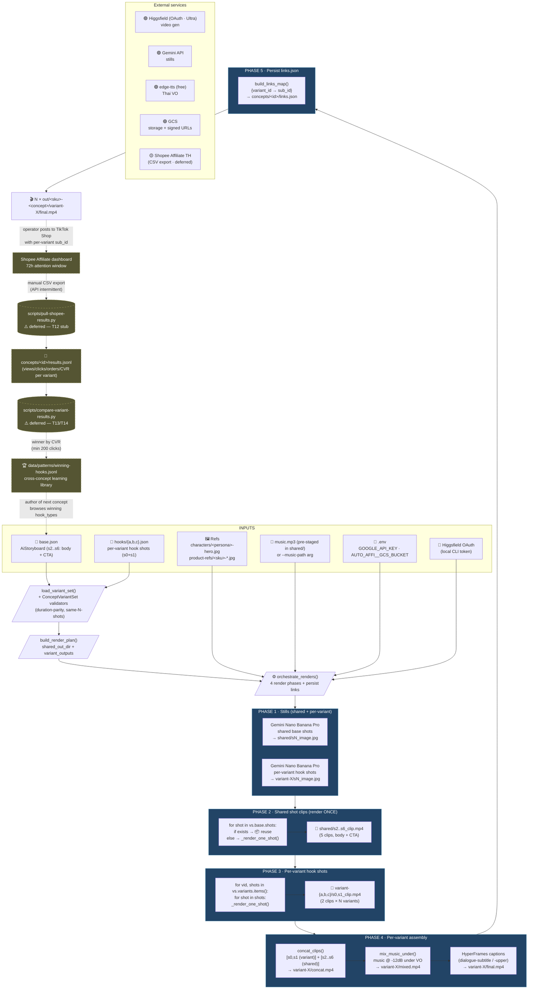
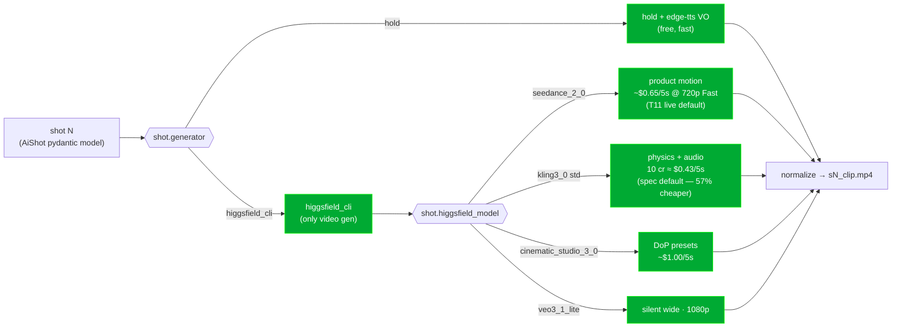

# Auto-Affi Pipeline — Current Workflow (v14, 2026-05-18)

This is the reference diagram for the production pipeline after the
**variant-testing** flow shipped (plan
[`docs/superpowers/plans/2026-05-18-variant-testing-pipeline.md`](superpowers/plans/2026-05-18-variant-testing-pipeline.md),
spec
[`docs/superpowers/specs/2026-05-18-auto-affi-variant-testing-design.md`](superpowers/specs/2026-05-18-auto-affi-variant-testing-design.md)).

The unit of work is no longer a single ad — it is **one concept × N
hook variants**, sharing a common body+CTA backbone. HeyGen has been
removed entirely (commit `373bfac`); Higgsfield-CLI + HOLD are the only
two video generators in the per-shot decision flow.

> v13 ([`docs/workflow-pipeline-v13.md`](workflow-pipeline-v13.md)) is
> **superseded for new productions** but kept as the historical
> reference for the single-ad path (`scripts/produce-ai-storyboard.py`).
> That script is still wired and still works — use it when you need
> exactly one ad and not a 3-way test.

Source-of-truth artifacts:
- Orchestrator: [`scripts/produce-variant-set.py`](../scripts/produce-variant-set.py)
- Schema: [`src/auto_affi/schemas/ai_storyboard.py`](../src/auto_affi/schemas/ai_storyboard.py) (`ConceptVariantSet`)
- Shot renderers: [`src/auto_affi/pipeline/shot_renderers.py`](../src/auto_affi/pipeline/shot_renderers.py)
- Higgsfield adapter: [`src/auto_affi/adapters/higgsfield_cli.py`](../src/auto_affi/adapters/higgsfield_cli.py)
- Live concept example: `data/registry/items/<sku>/concepts/<concept_id>/{base.json,hooks/*.json,links.json,results.jsonl}` (gitignored — per-product)
- Pattern library: `data/patterns/winning-hooks.jsonl` (gitignored, append-only)

## Directory layout (concept × variants)

```
data/registry/items/<sku>/concepts/<concept_id>/
├── base.json                  body + CTA shots (s2..s6) shared across variants
├── hooks/
│   ├── a.json                 variant A — hook shots (s0+s1)
│   ├── b.json                 variant B — hook shots
│   └── c.json                 variant C — hook shots
├── links.json                 variant_id → Shopee sub_id mapping (written by orchestrator)
└── results.jsonl              per-variant Shopee dashboard pulls (append-only, deferred)

data/patterns/
└── winning-hooks.jsonl        cross-concept learning log (append-only, deferred)

out/<sku>-<concept>/
├── shared/                    rendered ONCE, reused across all variants
│   ├── s2_clip.mp4 … s6_clip.mp4
│   └── music.mp3              optionally pre-staged
├── variant-a/
│   ├── s0_clip.mp4, s1_clip.mp4    hook-specific
│   └── final.mp4                    assembled per-variant
├── variant-b/
└── variant-c/
```

`data/registry/` and `out/` are gitignored — git tracks the framework,
not per-product artifacts.

## 5-phase orchestrator (`produce-variant-set.py`)



## Per-shot decision flow (the inner loop, simplified)

Every shot (base or variant) goes through the same per-shot router as
v13 — but the surface area is reduced. HeyGen / PiAPI / Phaya branches
are gone. Only **`higgsfield_cli`** and **`hold`** remain:



The model is chosen per-shot via the `higgsfield_model` field in the
storyboard JSON. The plan recommends `kling3_0` std as the new default
(57% cheaper than `seedance_2_0` Fast), but the live T11 run
(shure-vs-maono) used `seedance_2_0 @ 720p` per the concept author's
storyboard. **Both are supported** — `higgsfield_model` picks.

## Cost model (per concept = 3 variants)

Per spec section 8 + T11 actuals:

| Component | Shared? | Per concept |
|---|---|---|
| Stills × 7 × 3 variants (Gemini Nano Banana Pro) | per-variant | ~$0.42 |
| Body+CTA shots × 5 via Higgsfield @ 5s (shared) | YES | ~$2–3 |
| Hook shots × 2 × 3 variants via Higgsfield @ 5s | per-variant | ~$2.5–4 |
| edge-tts Thai VO | per-variant | $0 |
| HyperFrames caption overlays | per-variant | $0 |
| GCS storage | shared | <$0.01 |
| **Spec estimate (kling3_0 std)** | | **~$5.15** |
| **T11 actual (seedance_2_0 720p)** | | **~$6.00** |

T11 live validation (PD300X / shure-vs-maono, commit between `94ca148`
and now) produced 3 mp4s end-to-end for **~$6** total — vs naive "3
separate v13 ads" at $10.80 → **~44% savings** for the same 3-variant
output. The naive comparison is the more honest one because the 3
ads-vs-1 ad is a different unit; variant-testing replaces "ship one ad
and pray" with "ship three and measure".

Cost-per-variant works out to **~$2.00** — vs $3.60 for a v13 single
ad. The first variant is more expensive (it pays for the shared body
+ CTA renders), and each additional variant adds ~$0.86 marginal
(hook clips + assembly). The math favours 3-variant batches.

## Pattern-library learning loop (deferred)

Once the operator posts variants to TikTok / Shopee and accumulates
~72h of dashboard data:

```
results.jsonl  ──►  compare-variant-results.py  ──►  winning-hooks.jsonl
   ▲                                                      │
   │                                                      ▼
pull-shopee-results.py                          (author seeds next concept's
   ▲                                             hooks with proven hook_types
   │                                             + 1 experimental)
Shopee Affiliate dashboard (CSV or API)
```

`winning-hooks.jsonl` rows look like:
```json
{"ts":"2026-05-18","concept":"shure-vs-maono","winner":"b","hook_type":"price_comparison_text","hook_summary":"Side-by-side price text overlay","cvr":0.012,"sample_size":4280}
```

Author of next concept browses this file → seeds their 3 hook variants
with proven hook_types + 1 experimental. Knowledge compounds across
concepts instead of being lost to memory.

**Status: wiring deferred per spec section 10 step 5.** Neither
`pull-shopee-results.py` nor `compare-variant-results.py` exist yet —
the user directive is "no speculative measurement code before we know
the real Shopee API shape". T12/T13/T14 in the plan will wire these
once real `results.jsonl` data exists.

## What's deliberately NOT in this diagram

- **HeyGen / Avatar IV** — removed entirely in commit `373bfac` (Phase 1).
  The adapter, tests, lipsync driver script, `HEYGEN_AVATAR_IV` enum
  value, and dispatch branch are all gone. Recoverable via
  `git log --diff-filter=D` if ever needed.
- **PiAPI Seedance / Phaya 1.5 legacy branches** — still in the code
  for the v13 single-ad path but **not invoked by `produce-variant-set.py`**.
  The variant orchestrator only dispatches `higgsfield_cli` and `hold`
  (per spec — those are the only two generators needed for variant testing).
- **soul-id training** — not yet wired into either orchestrator.
- **Marketing Studio / Product Photoshoot / Marketplace Cards** —
  Higgsfield higher-level abstractions, not wired into the per-shot
  pipeline.
- **Registry / Sheets layer** — separate concern from this run-time view.
- **Compliance gate** — manual review step against each variant's
  final mp4 before TikTok-Shop upload.
- **Phase 5 measurement scripts** — see "Pattern-library learning loop"
  above. Deliberately deferred until real Shopee data exists.

## When to use v13 vs v14

| Situation | Pipeline |
|---|---|
| Shipping a single ad (no A/B/C test) | v13 — `scripts/produce-ai-storyboard.py` |
| Shipping a concept with 3 hook variants for testing | **v14 — `scripts/produce-variant-set.py`** |
| Backfilling old `storyboard.json` files | v13 (schema-compatible) |
| New product / new concept (default) | **v14** (variant-testing is the new default) |

v13 is **superseded** for new productions but is not deprecated — it
remains the right tool for one-off renders and is still tested. The
schema (`AiStoryboard`) is shared — `ConceptVariantSet` wraps it.
