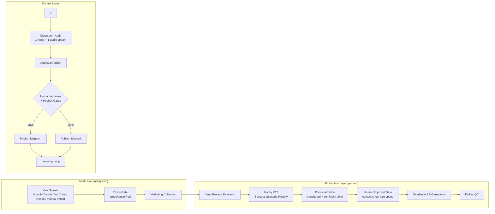

# 00 — Company Overview & Architecture

> **Auto-Affi** = AI-powered affiliate video production studio สำหรับตลาดไทย
> ดู viral signal แบบ real-time → เลือกสินค้า Shopee จริง 1 ตัว → ผลิตวิดีโอ UGC ระดับ Hollywood ด้วย AI → human approval → publish พร้อม compliance ครบ

**Source of truth:** [`SUPER_SPEC.md`](../SUPER_SPEC.md) (ISO 29110 Edition, updated 2026-06-05)

## Core Doctrine

## องค์กร: 24/7 Multi-Agent Studio + Human PM

| Division | หน้าที่ | ทีมย่อย |
|---|---|---|
| **Command Center** | Global orchestration (ISO PM.1) | Orchestrator |
| **Intel Group** | จับ signal ก่อนใคร | News Desk, Social Radar, Culture Analyst |
| **Control Group** | กันพัง กันผิดกฎ | Ethics, Compliance, Knowledge Librarian |

รายละเอียด seat ทั้ง 14 ตำแหน่ง → [04b-team-seats.md](04b-team-seats.md)

## Technical Stack

| Layer | Technology |
|---|---|
| **Post-production** | FFmpeg + HyperFrames (Thai caption overlay, muxing) |
| **Data layer** | Local CSV registry ใน [`data/`](04a-data-registry.md) + subId attribution 5 levels |
| **Platforms** | TikTok (API), Shopee (API/App Packet) |
| **Secrets** | `.env` เท่านั้น — ห้าม print/paste ค่า secret ทุกกรณี |

รายละเอียด model locks + routing → [03-model-locks-routing.md](03-model-locks-routing.md)

## System Architecture (high level)

Full production flow ละเอียด → [01-production-workflow.md](01-production-workflow.md)

## Repository Map

| Path | คืออะไร |
|---|---|
| `SUPER_SPEC.md` | Ultimate truth — spec รวม (ISO 29110) |
| `README.md` | Production usage guide — prompt ที่ใช้สั่งงาน |
| `handoff.md` | Sprint handoff (closed 2026-06-03) |
| `docs/principles/` | 17 principle/standard docs → [06-principles.md](06-principles.md) |
| `docs/research/` | 16 research docs → [07-research.md](07-research.md) |
| `data/` | 13 CSV registries → [04a-data-registry.md](04a-data-registry.md) |
| `runs/` | 11 production runs (3.1 GB) → [08-runs.md](08-runs.md) |
| `scripts/` | 4 utility scripts → [09-scripts-reports.md](09-scripts-reports.md) |
| `reports/` | Daily digest / scan reports |
| `.env` | Provider keys (ห้าม commit, ห้าม print) |

## ISO 29110 Traceability

Development artifacts วางแผนไว้ใน `iso29110/`: PM.1 Project Management Plan, SI.2 Requirements, SI.3 Design, SI.7 Traceability Matrix (planned)

> **หมายเหตุ:** git history แสดงว่าเคยมี Python codebase (`src/auto_affi/pipeline/`) ก่อนถูก hard-reset และ consolidate ความรู้เข้า SPEC (commit `5602e53c`) — ปัจจุบัน repo เป็น **docs-driven workflow OS** ที่ Claude/agent เป็น execution engine ตามหลัก "Markdown is the Source of Truth, AI is the Engine"

---
[← HOME](HOME.md) | [Production Workflow →](01-production-workflow.md)
