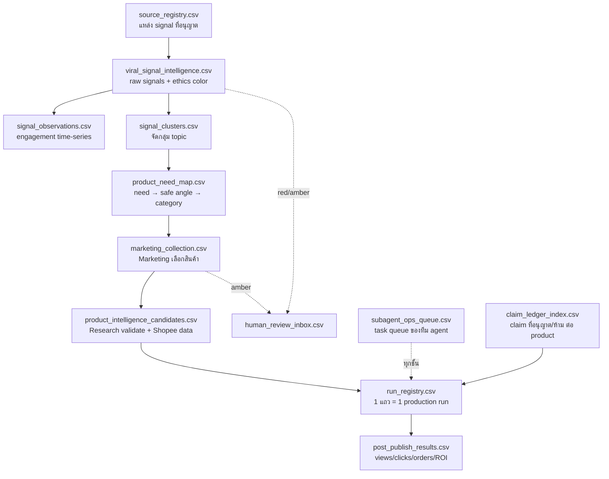

# 04 — Data Registry (CSV Layer)

> Data layer ทั้งหมดเป็น local CSV ใน [`data/`](../data/) — ออกแบบตาม [24/7 Subagent Team Blueprint](../docs/research/auto-affi-24-7-subagent-team-blueprint-th-2026-06-04.md) เพื่อให้ agent ทำงานได้โดยไม่พึ่ง chat memory

## Data Flow หลัก (3 ชั้น Intel → Production → Performance)

## ตารางทั้ง 13 ไฟล์

### Intel Layer

| File | Key | สรุป schema |
|---|---|---|
| `source_registry.csv` | `source_id` | แหล่ง signal: platform, access_method, cadence_minutes, quota_per_day, terms_mode, risk_level — คุมว่า scan อะไรได้ถี่แค่ไหน |
| `viral_signal_intelligence.csv` | `signal_id` | Raw signal: platform, topic, summary_th, harm_level, verification_status, demand_window, **ethics_color**, policy_risk, claim_risk, human_review_req |
| `signal_observations.csv` | `observation_id` | Time-series ต่อ signal: views/likes/comments/shares, velocity_1h/6h, sentiment_th, observer_agent |
| `signal_clusters.csv` | `cluster_id` | จัดกลุ่ม: normalized_topic_th, lead_signal_id, source_count, max_signal_score, ethics_color_max, recommended_need_th |
| `product_need_map.csv` | `need_id` | แปลง need → product: audience_need_th, **safe_angle_th / unsafe_angle_th**, shopee_query, claim_limits_th, ethics_gate |

### Production Layer

| File | Key | สรุป schema |
|---|---|---|
| `marketing_collection.csv` | `collection_id` | Marketing เลือก: product_idea_th, shopee_query, marketing_angle_th, buyer_archetype_th, hook_hypothesis_th, priority, ethics_color_initial |
| `product_intelligence_candidates.csv` | `record_id` | Research validated: news_summary_th, urgency_score, product_title, price_thb, commission_rate, shopee_url, evidence URLs, why_now_th |
| `claim_ledger_index.csv` | `claim_id` | Claim ต่อ product: claim_text_th, support_level, **allowed_rewrite_th / prohibited_phrasing_th**, claim_status |
| `run_registry.csv` | `run_id` | 1 แถว = 1 run: run_folder, creative_profile, run_status, brief/approval/route/council paths, final_mp4_path, affiliate_sub_id, cleanroom_status, virality_score, human_approval_status, publish_status, learning_status |
| `subagent_ops_queue.csv` | `task_id` | Task queue: owner_team/agent, stage, status, priority, next_action, retry_count, last_error, human_action_needed |

### Control & Performance Layer

| File | Key | สรุป schema |
|---|---|---|
| `human_review_inbox.csv` | `review_id` | Amber/red escalation: review_type, ethics_color, question_th, recommended_decision, decision, decided_by |
| `post_publish_results.csv` | `result_id` | ผลหลัง publish: platform, views, watch_time, retention_pct, clicks, orders, commission_thb, roi_score, learning_notes_th |
| `social_media_imports/` | — | Manual import template สำหรับ social listening CSV (TikTok ยัง access-gated) |

## Lifecycle ของ signal → run

`captured → normalized → clustered → scored → ethics gate → product mapping → marketing collection → research validation → prompt council → generation → QA → publish → learning`

**Trend score formula:** freshness 0.20 + velocity 0.20 + thai_relevance 0.15 − harm_risk 0.25

## ใครเขียนไฟล์ไหน

- [`scripts/social_media_scanner.py`](09-scripts-reports.md) อ่าน/เขียน 7 ไฟล์ intel layer + สร้าง `reports/social_scan_*.md`
- Production run (agent workflow) เขียน `run_registry.csv`, `claim_ledger_index.csv`, `subagent_ops_queue.csv`
- หลัง publish: `post_publish_results.csv` (ยังว่าง — ยังไม่มี run ไหน publish จริง)

> **สถานะปัจจุบัน:** ทุก run ยัง publish-blocked เพราะ **affiliate URL/subIds ยังไม่เคยถูกใส่** — นี่คือ blocker ใหญ่สุดของทั้ง pipeline (ดู [08-runs.md](08-runs.md))

---
[← Model Locks](03-model-locks-routing.md) | [HOME](HOME.md) | [Team Seats →](04b-team-seats.md)
